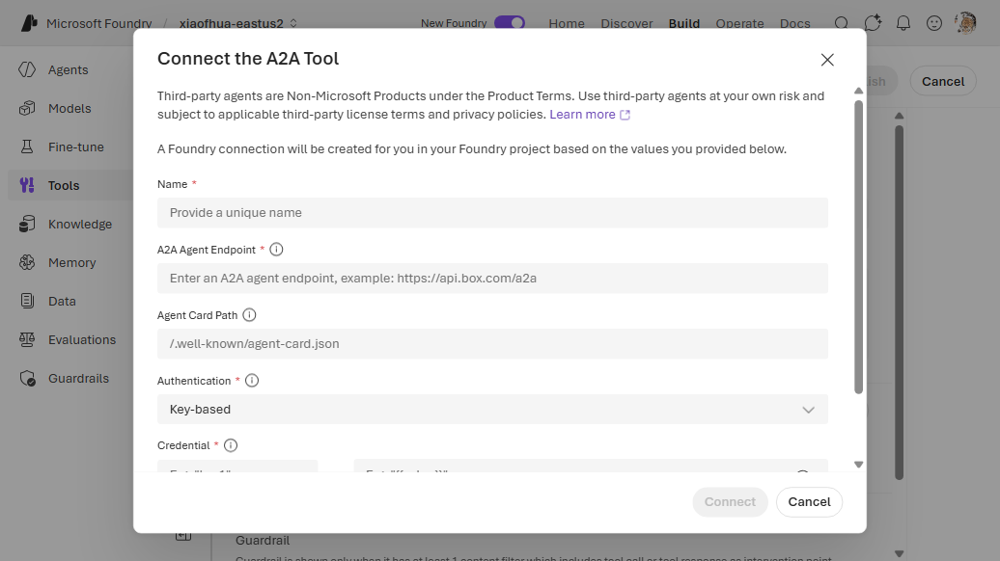
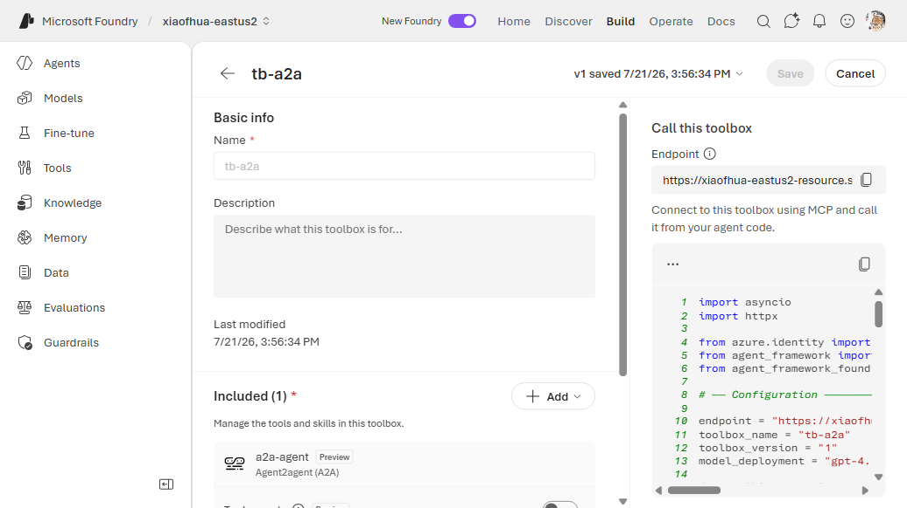

# 11. A2A (Agent-to-Agent)

Call **another Foundry agent as a tool**. The remote agent exposes an A2A-compatible endpoint; the
toolbox references it through a `RemoteA2A` connection so your agent can delegate work to it.

**Connection required?** Yes (`RemoteA2A`, `authType: None` for a public endpoint).

---

## VS Code (Foundry Toolkit)

1. Open the **Foundry Toolkit** view from the **Activity Bar** and sign in. Under **Developer
   Tools** → **Discover**, open **Tool Catalog**. On the **Catalog** tab, under **Toolboxes**, click
   the **Create Your Toolbox** card to open **Build a Custom Toolbox**.

   
2. Under **Basic info**, enter a **Name** (e.g. `agent-tools`) and an optional description. In the
   **Included** panel, click **+ Add ▾** → **Add tools**.

   

3. In the **Select a tool** dialog, switch to the **Custom** tab. Under **Foundry Connection**,
   select **A2A Agent**, then enter a **Name** and the remote agent endpoint (with auth if the
   endpoint is protected). Click **Add Tools**.

   

4. Back on **Build a Custom Toolbox**, click **Publish**. The toolbox appears on the **Toolboxes**
   tab. Use the copy icon in the **Endpoint URL** column to copy the consumer MCP endpoint into your
   agent's `TOOLBOX_ENDPOINT` — or click **Scaffold code template** to generate a hosted agent
   wired to it.

   

---

## 1. Create the connection

```bash
azd ai connection create a2aconn \
  --kind remote-a2a \
  --target "https://<my-agent>.azurecontainerapps.io" \
  --auth-type none \
  --project-endpoint "$FOUNDRY_PROJECT_ENDPOINT"
```

## 2a. CLI — Way A (`toolbox.yaml`)

```yaml
# toolbox.yaml
description: a2a toolbox
tools:
  - type: a2a_preview
    name: a2a
    project_connection_id: a2aconn
    require_approval: "never"
```

```bash
azd ai toolbox create agent-tools --from-file ./toolbox.yaml --project-endpoint "$FOUNDRY_PROJECT_ENDPOINT"
```

## 2b. CLI — Way B (`azure.yaml`)

```yaml
# azure.yaml
name: my-agent-project
services:
  agent-tools:
    host: azure.ai.toolbox
    tools:
      - type: a2a_preview
        name: a2a
        project_connection_id: a2aconn
  my-agent:
    host: azure.ai.agent
    uses:
      - agent-tools
    environmentVariables:
      - name: TOOLBOX_NAME
        value: agent-tools
```

```bash
azd deploy agent-tools
```

---

## Portal (Foundry / Azure)

1. In the [Foundry portal](https://ai.azure.com/), open **Tools** → **Toolboxes** tab →
   **Create toolbox**. Give it a **Name**.
2. Under **Included**, click **+ Add** → **Add tool** → the **Custom** tab → **Agent2agent (A2A)**
   → **Create**.
3. In the dialog, enter a **Name** and the remote agent endpoint. Click **Connect**.
4. Click **Publish** and copy the endpoint into `TOOLBOX_ENDPOINT`.





---

## Notes

- `a2a_preview` is a preview tool type.
- For an authenticated remote agent, use the appropriate auth type on the connection instead of
  `none`.

## References

- [A2A tool documentation](https://learn.microsoft.com/azure/foundry/agents/how-to/tools/a2a)
