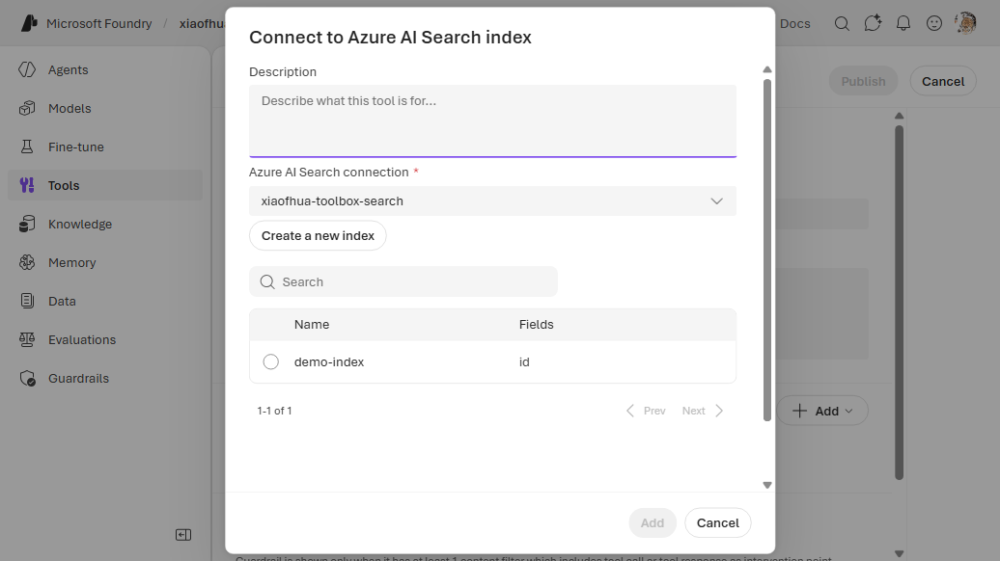
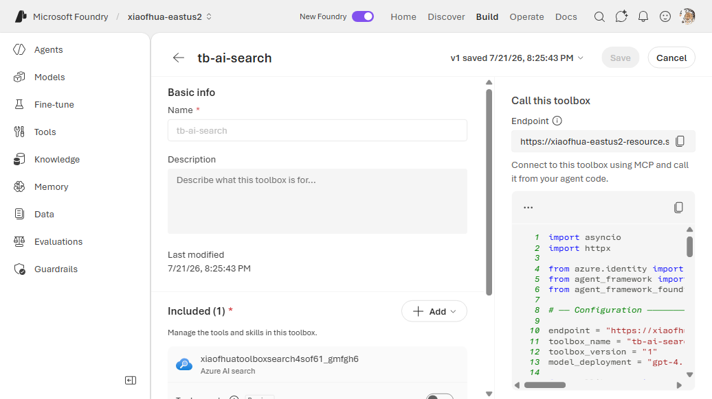
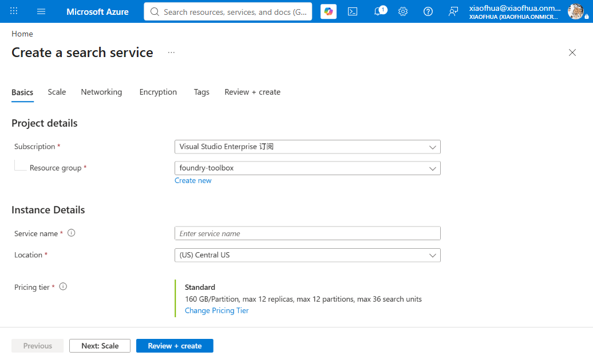
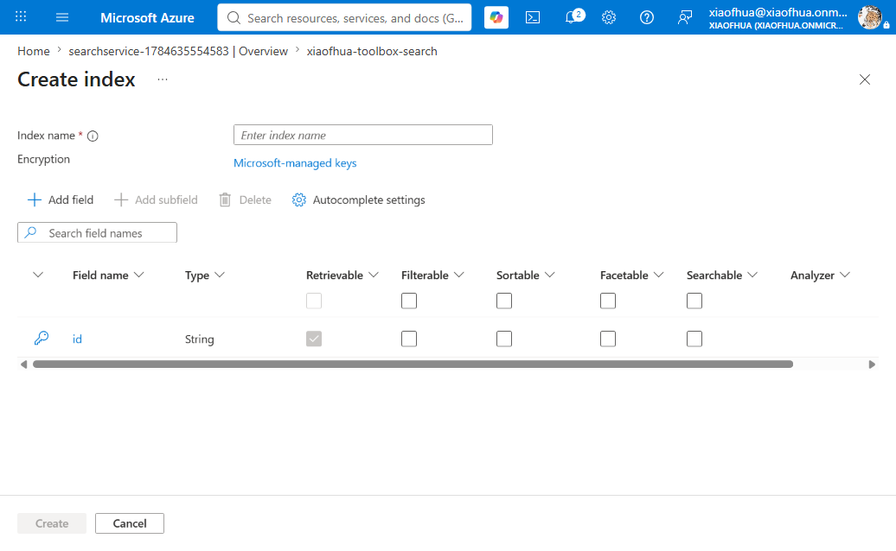

# 10. Azure AI Search

Query an existing **Azure AI Search** index from the agent. The search service credentials live in
a `CognitiveSearch` connection (`ApiKey`); the toolbox references it and the index name.

**Connection required?** Yes (`ApiKey`). **Prerequisite:** an existing search service + index.

---

## 1. Create the connection

```bash
azd ai connection create aisearchconn \
  --kind cognitive-search \
  --target "https://<my-search>.search.windows.net/" \
  --auth-type api-key \
  --api-key "<ai_search_admin_key>" \
  --project-endpoint "$FOUNDRY_PROJECT_ENDPOINT"
```

## 2a. CLI — Way A (`toolbox.yaml`)

```yaml
# toolbox.yaml
description: ai-search toolbox
tools:
  - type: azure_ai_search
    name: azure_ai_search
    index_name: "<your_index_name>"
    project_connection_id: aisearchconn
    require_approval: "never"
```

```bash
azd ai toolbox create agent-tools --from-file ./toolbox.yaml --project-endpoint "$FOUNDRY_PROJECT_ENDPOINT"
```

## 2b. CLI — Way B (`azure.yaml`)

```yaml
# azure.yaml
name: my-agent-project
services:
  agent-tools:
    host: azure.ai.toolbox
    tools:
      - type: azure_ai_search
        name: azure_ai_search
        index_name: "<your_index_name>"
        project_connection_id: aisearchconn
  my-agent:
    host: azure.ai.agent
    uses:
      - agent-tools
    environmentVariables:
      - name: TOOLBOX_NAME
        value: agent-tools
```

```bash
azd deploy agent-tools
```

---

## Portal (Foundry / Azure)

1. In the [Foundry portal](https://ai.azure.com/), open **Tools** → **Toolboxes** tab →
   **Create toolbox**. Give it a **Name**.
2. Under **Included**, click **+ Add** → **Add tool**. On the **Configured** tab, select **Azure AI
   search**, then **Add tool**.
3. In the **Connect to Azure AI Search index** dialog, pick an existing **Azure AI Search
   connection**. If you have none, click **connect to a new resource** → **Create a new connection**:
   choose an existing Search service (Auth Type **API Key**), or click **Create a new resource** to
   provision one in the Azure portal (see box below). Then select the **index** from the list.

   
4. Click **Add tool**, then **Publish**, and copy the endpoint into `TOOLBOX_ENDPOINT`.

   

> **Provisioning a new Search service (Azure portal).** The **Create a new resource** link opens the
> Azure portal **Create a search service** wizard. Pick the subscription, resource group, a unique
> **Service name**, region, and **Pricing tier** (Standard is billable — see pricing before
> creating), then **Review + create** → **Create**. After it deploys, open the service and click
> **Add index** to create at least one index (the toolbox tool requires an existing index). Return to
> the Foundry dialog, **Refresh resources**, and select the new service + index.
>
> 
>
> 

## VS Code (Foundry Toolkit)

1. Open the **Microsoft Foundry** view and sign in.
2. **Connections** → **Create connection** → **Azure AI Search**.
3. **Tools** → **Toolboxes** → **Create toolbox** → add **Azure AI Search** → select connection +
   index.


---

## Notes

- For multiple indexes, add one `azure_ai_search` entry per index (each needs a unique `name`).

## References

- [Azure AI Search tool documentation](https://learn.microsoft.com/azure/foundry/agents/how-to/tools/azure-ai-search)
