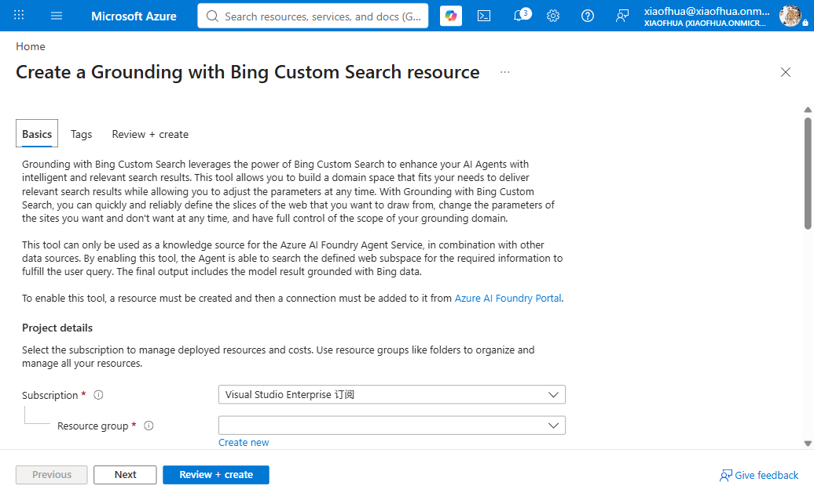
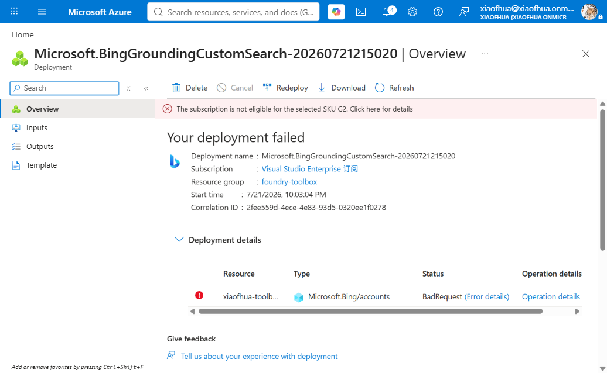

# 12. Bing Custom Search

Like [web search](web-search.md), but **scoped to specific domains** via a Bing Custom Search
instance. Uses a `GroundingWithCustomSearch` connection plus a custom-search configuration on the
`web_search` tool.

**Connection required?** Yes (`ApiKey`, `GroundingWithCustomSearch`). **Prerequisite:** a Bing
Custom Search instance + a Bing account resource ID.

---

## 1. Create the connection

```bash
azd ai connection create bingcustomconn \
  --kind grounding-with-custom-search \
  --target https://api.bing.microsoft.com/ \
  --auth-type api-key \
  --api-key "<bing_api_key>" \
  --metadata "ResourceId=<bing_resource_id>" \
  --metadata "type=bing_custom_search_preview" \
  --project-endpoint "$FOUNDRY_PROJECT_ENDPOINT"
```

## 2a. CLI — Way A (`toolbox.yaml`)

```yaml
# toolbox.yaml
description: bing-custom-search toolbox
tools:
  - type: web_search
    name: web_search
    custom_search_configuration:
      instance_name: "<bing_custom_instance>"
      project_connection_id: bingcustomconn
    require_approval: "never"
```

```bash
azd ai toolbox create agent-tools --from-file ./toolbox.yaml --project-endpoint "$FOUNDRY_PROJECT_ENDPOINT"
```

## 2b. CLI — Way B (`azure.yaml`)

```yaml
# azure.yaml
name: my-agent-project
services:
  agent-tools:
    host: azure.ai.toolbox
    tools:
      - type: web_search
        name: web_search
        custom_search_configuration:
          instance_name: "<bing_custom_instance>"
          project_connection_id: bingcustomconn
  my-agent:
    host: azure.ai.agent
    uses:
      - agent-tools
    environmentVariables:
      - name: TOOLBOX_NAME
        value: agent-tools
```

```bash
azd deploy agent-tools
```

---

## Portal (Foundry / Azure)

1. In the [Foundry portal](https://ai.azure.com/), open **Tools** → **Toolboxes** tab →
   **Create toolbox**. Give it a **Name**.
2. Under **Included**, click **+ Add** → **Add tool**. On the **Configured** tab, select **Web
   search**, then **Add tool**.
3. In the **Add the Web Search Tool** dialog, set **Search type** to **Search specific domains with
   Bing Custom Search**. Under **Grounding with Bing Custom Search connection**, pick an existing
   connection or **Connect to a new resource**; then select the **resource configuration**
   (instance).

   
4. Click **Add**, then **Publish**, and copy the endpoint into `TOOLBOX_ENDPOINT`.

> **Provisioning a Bing Grounding resource (Azure portal).** **Connect to a new resource** →
> **Create a new connection** → **Create a new resource** opens the Azure portal **Create a Grounding
> with Bing Custom Search resource** wizard (subscription, resource group, name, pricing tier —
> pay-per-transaction — plus a terms checkbox).
>
> 
>
> ⚠️ **Subscription eligibility:** Grounding with Bing Custom Search requires an **eligible
> subscription**. On some subscription types (e.g. Visual Studio Enterprise) creation fails with
> *"The subscription is not eligible for the selected SKU"*. If you hit this, use a different
> subscription or an alternative grounding source ([basic web search](web-search.md)).
>
> 

## VS Code (Foundry Toolkit)

1. Open the **Microsoft Foundry** view and sign in.
2. **Connections** → **Create connection** → **Grounding with Bing Custom Search**.
3. **Tools** → **Toolboxes** → **Create toolbox** → add **Web search** with custom search config.


---

## Notes

- For unscoped public web search with no connection, use [basic web search](web-search.md).

## References

- [Web Search / Grounding with Bing Custom Search](https://learn.microsoft.com/azure/foundry/agents/how-to/tools/web-overview)
