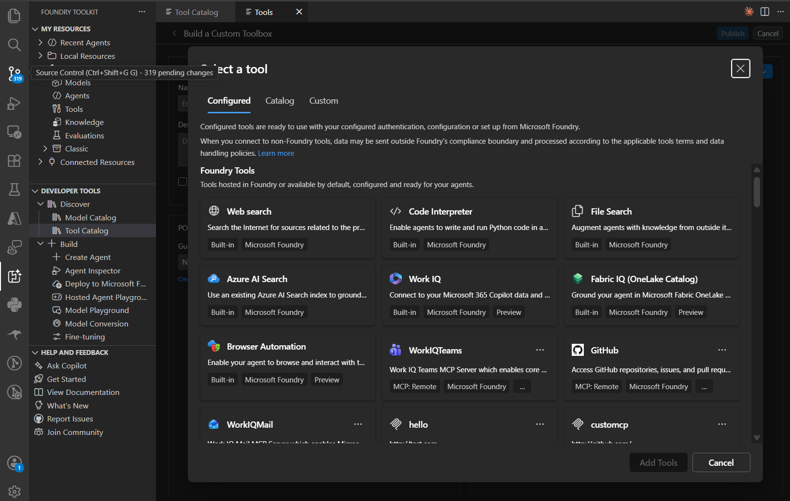
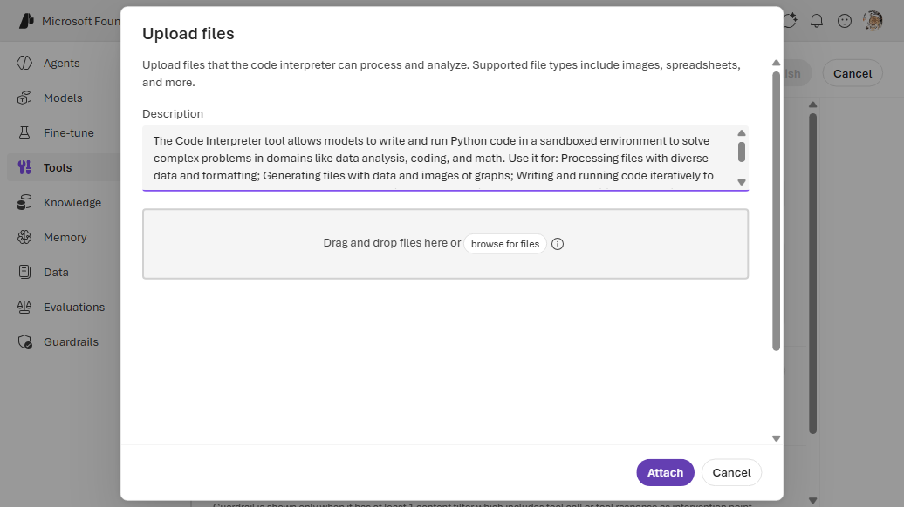
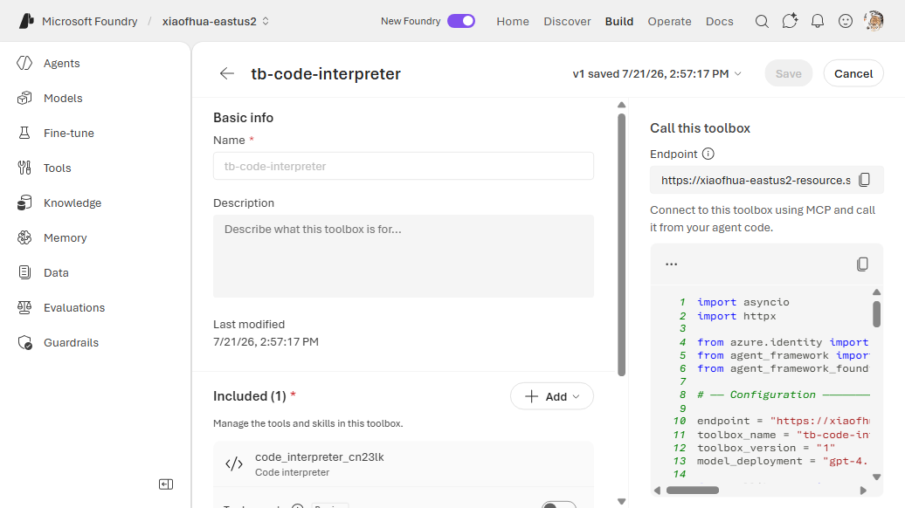

# 3. Code Interpreter

Executes Python code in a secure, sandboxed environment and returns the output. Useful for
calculations, data manipulation, and chart generation. Connectionless built-in — no secrets.

---

## VS Code (Foundry Toolkit)

1. Open the **Foundry Toolkit** view from the **Activity Bar** and sign in. Under **Developer
   Tools** → **Discover**, open **Tool Catalog**. On the **Catalog** tab, under **Toolboxes**, click
   the **Create Your Toolbox** card to open **Build a Custom Toolbox**.

   
2. Under **Basic info**, enter a **Name** (e.g. `agent-tools`) and an optional description. In the
   **Included** panel, click **+ Add ▾** → **Add tools**.

   

3. In the **Select a tool** dialog, stay on the **Configured** tab. Under **Foundry Tools**, select
   the **Code Interpreter** card (Built-in · Microsoft Foundry) — no connection is needed — then
   click **Add Tools**.

   

4. Back on **Build a Custom Toolbox**, click **Publish**. The toolbox appears on the **Toolboxes**
   tab. Use the copy icon in the **Endpoint URL** column to copy the consumer MCP endpoint into your
   agent's `TOOLBOX_ENDPOINT` — or click **Scaffold code template** to generate a hosted agent
   wired to it.

   

---

## CLI — Way A (`toolbox.yaml`)

```yaml
# toolbox.yaml
description: code-interpreter toolbox
tools:
  - type: code_interpreter
    name: code_interpreter
    require_approval: "never"
```

```bash
azd ai toolbox create agent-tools --from-file ./toolbox.yaml --project-endpoint "$FOUNDRY_PROJECT_ENDPOINT"
```

## CLI — Way B (`azure.yaml`)

```yaml
# azure.yaml
name: my-agent-project
services:
  agent-tools:
    host: azure.ai.toolbox
    tools:
      - type: code_interpreter
        name: code_interpreter
  my-agent:
    host: azure.ai.agent
    uses:
      - agent-tools
    environmentVariables:
      - name: TOOLBOX_NAME
        value: agent-tools
```

```bash
azd deploy agent-tools
```

---

## Portal (Foundry / Azure)

1. In the [Foundry portal](https://ai.azure.com/), open **Tools** → **Toolboxes** tab →
   **Create toolbox**.
2. Give the toolbox a **Name**. Under **Included**, click **+ Add** → **Add tool**.
3. On the **Configured** tab of the **Select a tool** dialog, select **Code interpreter** (no
   connection required) → **Add tool**.
4. Click **Publish** and copy the endpoint into `TOOLBOX_ENDPOINT`.





---

## References

- [Code Interpreter tool documentation](https://learn.microsoft.com/azure/foundry/agents/how-to/tools/code-interpreter)
