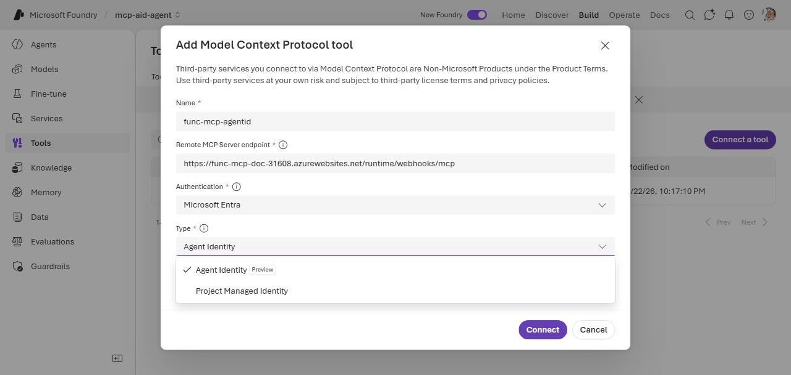
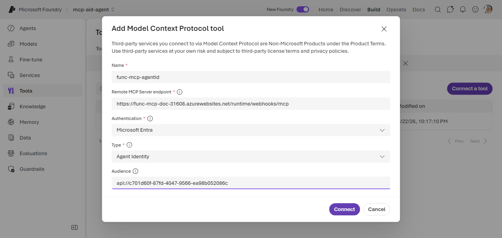
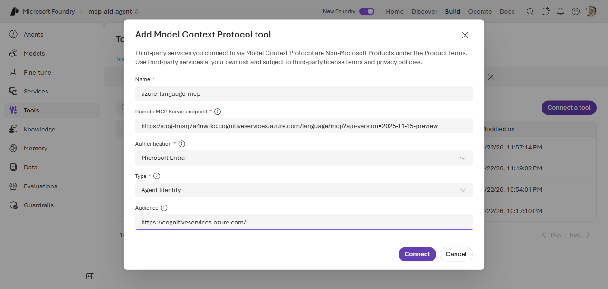
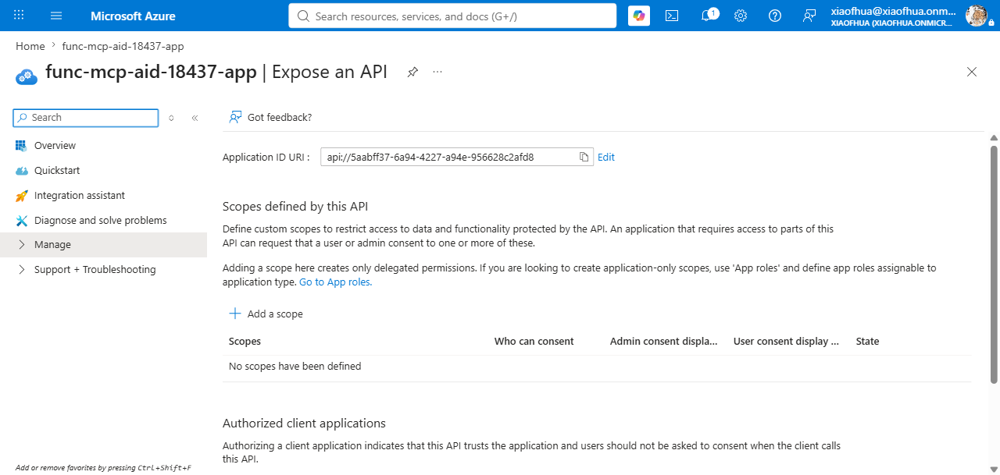
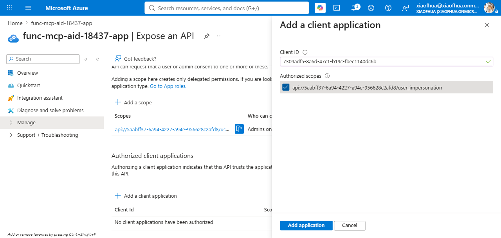

# 8. MCP — Agent Identity / Project Managed Identity

Connect to an MCP server that accepts an **Entra ID token issued for a Foundry-managed identity**
(no user in the loop, no stored secret). Foundry acquires the token and presents it to the server;
you authorize the identity on the target server before the agent invokes it.

**Connection required?** Yes (`AgenticIdentityToken` or `ProjectManagedIdentity`). **Example
servers:** Azure Language MCP server (Microsoft-hosted — [Option A](#option-a--microsoft-hosted-mcp-server)),
your own Azure Functions MCP (self-hosted — [Option B](#option-b--your-own-mcp-server)).

---

## Prerequisites

Pick the **sub-type** by *which* identity should call the server:

| Sub-type | CLI `--auth-type` | Stored `authType` | Identity used |
|---|---|---|---|
| **Agent Identity** | `agentic-identity` | `AgenticIdentityToken` | the **agent's own** managed identity (unique per published agent) |
| **Project Managed Identity** | `project-managed-identity` | `ProjectManagedIdentity` | the **shared project** managed identity (all agents share it) |

Both are **app-only** (the token represents a service principal, not a user). For per-user access, or
a comparison with the OAuth / passthrough modes, see
[MCP authentication modes compared](../README.md#mcp-authentication).

> **Agent identity only resolves inside a published agent.** You can't validate it with a standalone
> `tools/list` against the toolbox — that returns `AgenticIdentityToken ... requires
> AgentInstanceClientId`. The token is minted only when a **deployed, published agent** invokes the
> toolbox. Project managed identity resolves without an agent, so use it to test the wiring first.

You also need the connection's **audience** — the Entra resource the target server validates the
token against. Foundry mints the token *for this audience*, and the server accepts it only if the
`aud` matches. Where it comes from depends on the server:

| Your MCP is… | Authorize the identity by… | Audience | Follow |
|---|---|---|---|
| **Option A — Microsoft-hosted** (e.g. Azure Language MCP) | granting an **RBAC role** on the target Azure resource | a well-known value, e.g. `https://cognitiveservices.azure.com/` (see the server's docs) | [Option A](#option-a--microsoft-hosted-mcp-server) |
| **Option B — your own server** (e.g. Azure Functions + Easy Auth) | **allow-listing** the identity's client ID on your server | the app ID URI of your server's Entra app, `api://<your-app-id>` | [Option B](#option-b--your-own-mcp-server) |

### Option A — Microsoft-hosted MCP server

Microsoft already built the server to accept Foundry-managed-identity tokens. Use the server's
documented **audience** (e.g. `https://cognitiveservices.azure.com/` for Azure Language MCP), and
authorize by granting the identity an **RBAC role** — see [CLI](#3-authorize-the-identity) /
[Portal](#portal-foundry--azure).

### Option B — your own MCP server

Your server (e.g. an MCP on **Azure Functions** behind App Service built-in authentication / "Easy
Auth") validates the token itself, so it accepts a Foundry-managed-identity token only when **all
three** line up:

1. **Audience** — the server's accepted audiences include the connection's `--audience`
   (`api://<your-app-id>`).
2. **Issuer** — your tenant's v2 issuer, `https://login.microsoftonline.com/<tenant-id>/v2.0`.
3. **Allowed application** *(the key step)* — the calling identity's **client ID** is on the
   server's allow-list. Omitting this is the most common cause of a `401` from an otherwise-correct
   server: the token passes audience/issuer validation but the caller isn't an allowed application.

If you don't know the audience, probe the server — an unauthenticated request returns a `401` with a
`WWW-Authenticate` header naming the expected resource:

```bash
curl -s -i https://<server>/mcp -X POST -d '{}' | grep -i www-authenticate
# Bearer ... scope="api://<app-id>/user_impersonation", resource_metadata="https://.../.well-known/oauth-protected-resource..."
```

Configuring the server's Entra authentication itself (enabling Easy Auth, registering the API app,
setting audiences) is server-side setup outside this guide. This page covers **what the identity
needs from that config** — the audience match and the allow-list, done in
[step 3](#3-authorize-the-identity).

---

## CLI (`azd` + `az`)

### 1. Create the connection

Pick the `--auth-type` for your sub-type; pass the [audience](#prerequisites) for your server.

```bash
azd ai connection create langmcpconn \
  --kind remote-tool \
  --target "https://<language-service>.cognitiveservices.azure.com/language/mcp?api-version=2025-11-15-preview" \
  --auth-type agentic-identity \
  --audience "https://cognitiveservices.azure.com/" \
  --project-endpoint "$FOUNDRY_PROJECT_ENDPOINT"

# Project Managed Identity — swap the auth-type:  --auth-type project-managed-identity
# Option B — set --target to your MCP endpoint and --audience to api://<your-app-id>
```

### 2. Create the toolbox and deploy the agent

Agent identity is minted only for a **published** agent, so declare the toolbox and agent together
and deploy — this publishes the agent whose identity you authorize in step 3.

```yaml
# azure.yaml
name: my-agent-project
services:
  agent-tools:
    host: azure.ai.toolbox
    tools:
      - type: mcp
        server_label: language-mcp
        project_connection_id: langmcpconn
  my-agent:
    host: azure.ai.agent
    uses:
      - agent-tools
    environmentVariables:
      - name: TOOLBOX_NAME
        value: agent-tools
```

```bash
azd up   # provision + deploy the project and publish the agent
```

### 3. Authorize the identity

The agent is now published, so its identity exists. First get the identity's IDs:

```bash
# Project managed identity → the Foundry account's system-assigned identity
PRINCIPAL=$(az cognitiveservices account show -n <foundry-account> -g <rg> --query "identity.principalId" -o tsv)
APP_ID=$(az ad sp show --id "$PRINCIPAL" --query appId -o tsv)   # its app (client) ID

# Agent identity → SPs named after the account/project/agent, ending in "-AgentIdentity";
# list them and pick the one for your agent:
az ad sp list --all --query "[?ends_with(displayName,'-AgentIdentity')].{name:displayName, appId:appId}" -o table
```

**Option A — Microsoft-hosted server:** grant the identity an **RBAC role** on the target resource.

```bash
az role assignment create --assignee "$PRINCIPAL" \
  --role "Cognitive Services User" \
  --scope "/subscriptions/<sub>/resourceGroups/<rg>/providers/Microsoft.CognitiveServices/accounts/<language-service>"
```

**Option B — your own server:** add the identity's **client ID** to the server's Easy Auth
allow-list (`allowedApplications`). Use the **agent identity** app ID for `AgenticIdentityToken`, or
the **project resource** app ID for `ProjectManagedIdentity`.

```bash
SUB=<sub>; RG=<function-rg>; FA=<function-app>
TENANT=$(az account show --query tenantId -o tsv)
FUNC_APP_ID=<function-entra-app-id>          # the app registered for your Function's Easy Auth
AGENT_APP_ID=<agent-identity-app-id>         # from the list above

cat > authv2.json <<EOF
{ "properties": {
  "platform": { "enabled": true, "runtimeVersion": "~1" },
  "globalValidation": { "requireAuthentication": true, "unauthenticatedClientAction": "Return401" },
  "identityProviders": { "azureActiveDirectory": {
    "enabled": true,
    "registration": { "openIdIssuer": "https://login.microsoftonline.com/$TENANT/v2.0", "clientId": "$FUNC_APP_ID" },
    "validation": {
      "allowedAudiences": [ "api://$FUNC_APP_ID", "$FUNC_APP_ID" ],
      "defaultAuthorizationPolicy": { "allowedApplications": [ "$FUNC_APP_ID", "$AGENT_APP_ID" ] }
    }
  }}
}}
EOF

az rest --method put \
  --url "https://management.azure.com/subscriptions/$SUB/resourceGroups/$RG/providers/Microsoft.Web/sites/$FA/config/authsettingsV2?api-version=2022-03-01" \
  --body @authv2.json
```

---

## Portal (Foundry / Azure)

### 1. Create the connection

In the [Foundry portal](https://ai.azure.com/), open **Build** → **Tools** → **Connect a tool** →
the **Custom** tab → **Model Context Protocol (MCP)** → **Create**. Enter a **Name** and **Remote
MCP Server endpoint**, set **Authentication** to **Microsoft Entra**, then choose the **Type** —
**Agent Identity** or **Project Managed Identity** — and enter the **Audience**.



Filled in for an agent-identity connection, then **Connect**:



### 2. Create the toolbox and deploy the agent

Under **Tools** → **Toolboxes** → **Create toolbox**, add the MCP tool, then **Publish**. Deploy an
agent that uses the toolbox (`azd up`, or the portal agent builder) so its identity exists for the
next step.

### 3. Authorize the identity

First create the connection with **Microsoft Entra** → **Agent Identity** and the server's audience
(e.g. `https://cognitiveservices.azure.com/` for Azure Language MCP):



**Option A — Microsoft-hosted server:** in the [Azure portal](https://portal.azure.com/), open the
target resource → **Access control (IAM)** → **Add role assignment**, and grant the project/agent
managed identity the required role (e.g. **Cognitive Services User**). After assignment, the role
shows the project managed identity and each published agent's identity:


**Option B — your own server:** the audience and the caller allow-list live wherever your server
validates the token. Use **whichever one** matches your server — you don't do both:

- **Own Entra-app-protected server** → configure it in the **Entra app registration**.
- **Azure Functions behind Easy Auth** → configure it in the Function App's **Easy Auth**.

#### Option B-1 — Entra app registration

This is where the **audience** is defined: the app's **Application ID URI** (`api://<your-app-id>`)
on the **Expose an API** blade — pass this exact value as the connection's audience:



To allow-list a caller, use **Authorized client applications** → **Add a client application** (the app
must publish a scope first). Enter the identity's **client ID** (agent identity app ID for
`AgenticIdentityToken`, or the project resource app ID for `ProjectManagedIdentity`) and check the
scope:



#### Option B-2 — Azure Functions Easy Auth

If instead your MCP runs on **Azure Functions with Easy Auth**, open the Function App's
**Authentication** blade → **Edit identity provider**. The audience is under **Allowed token
audiences**; under **Client application requirement** choose **Allow requests from specific client
applications** → **Edit application IDs** and add the identity's **client ID** (agent identity app ID
for `AgenticIdentityToken`, or the project resource app ID for `ProjectManagedIdentity`):


---

## VS Code (Foundry Toolkit)

1. Open the **Microsoft Foundry** view and sign in.
2. **Connections** → **Create connection** → **MCP (agent identity)** → set target + audience.
3. **Tools** → **Toolboxes** → **Create toolbox** → add MCP server → select the connection.
4. Deploy the agent and authorize the identity ([step 3](#3-authorize-the-identity)).


---

## Test in the remote agent

However you created the connection, toolbox, and agent (CLI, portal, or VS Code), validate the same
way: make sure the agent's `TOOLBOX_ENDPOINT` points at the toolbox, then invoke the **published**
agent with a prompt that uses the tool.

```bash
azd ai agent invoke <agent-name> "Use the <tool> to ..."
```

The agent's runtime acquires the managed-identity token and calls the MCP server. On success, the
tool output appears in the response. If it fails, see [Troubleshooting](#troubleshooting).

---

## Troubleshooting

| Symptom | Cause | Fix |
|---|---|---|
| `AgenticIdentityToken ... requires AgentInstanceClientId` on `tools/list` | Agent identity resolves only inside a **published agent**, not a standalone toolbox call. | Invoke through a deployed agent, or test the wiring with **project managed identity** first. |
| **`401`** from the server | The token was *rejected*: audience, issuer, or allow-list mismatch (Option B), or the server doesn't accept managed-identity tokens. | Confirm the server's accepted **audience** matches the connection's `--audience`, the **issuer** is your tenant's v2 endpoint, and the identity's **client ID is allow-listed** ([step 3, Option B](#3-authorize-the-identity)). |
| **`403`** from the server | The token was *accepted* but the identity lacks permission. | Grant the required **RBAC role** on the target resource (Option A), or confirm the correct client ID is in **allowedApplications** (Option B). |

## References

- [MCP tool documentation](https://learn.microsoft.com/azure/foundry/agents/how-to/tools/model-context-protocol)
- [Azure Language MCP server](https://learn.microsoft.com/azure/ai-services/language-service/concepts/foundry-tools-agents)
