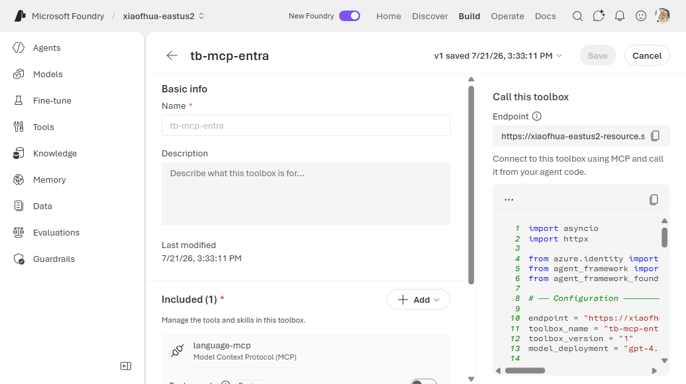

# 8. MCP — Agent Identity / Project Managed Identity

Connect to an MCP server that accepts an **Entra ID token issued for a Foundry-managed identity**
(no user in the loop, no stored secret). Foundry acquires the token and presents it to the server;
you authorize by assigning that identity an **RBAC role** on the target resource before deploying.

Pick the sub-type by *which* identity should call the server:

| Sub-type | CLI `--auth-type` | Stored `authType` | Identity used |
|---|---|---|---|
| **Agent Identity** | `agentic-identity` | `AgenticIdentityToken` | the **agent's own** managed identity (unique per published agent) |
| **Project Managed Identity** | `project-managed-identity` | `ProjectManagedIdentity` | the **shared project** managed identity (all agents share it) |

Both are **app-only** (the token represents a service principal, not a user). For per-user access, or
a comparison with the OAuth / passthrough modes, see
[MCP authentication modes compared](../README.md#mcp-authentication).

**Connection required?** Yes (`AgenticIdentityToken` or `ProjectManagedIdentity`). **Example
server:** Azure Language MCP server.

---

## 1. Create the connection

Pick the `--auth-type` matching the identity you want (see the table above).

```bash
# Agent Identity — the agent's own managed identity
azd ai connection create langmcpconn \
  --kind remote-tool \
  --target "https://<language-service>.cognitiveservices.azure.com/language/mcp?api-version=2025-11-15-preview" \
  --auth-type agentic-identity \
  --audience "https://cognitiveservices.azure.com/" \
  --project-endpoint "$FOUNDRY_PROJECT_ENDPOINT"

# Project Managed Identity — the shared project MI (swap the auth-type)
#   --auth-type project-managed-identity
```

> **audience** — the Entra resource the target server validates tokens against.

## 2a. CLI — Way A (`toolbox.yaml`)

```yaml
# toolbox.yaml
description: agent-identity-mcp toolbox
tools:
  - type: mcp
    server_label: language-mcp
    project_connection_id: langmcpconn
    require_approval: "never"
```

```bash
azd ai toolbox create agent-tools --from-file ./toolbox.yaml --project-endpoint "$FOUNDRY_PROJECT_ENDPOINT"
```

## 2b. CLI — Way B (`azure.yaml`)

```yaml
# azure.yaml
name: my-agent-project
services:
  agent-tools:
    host: azure.ai.toolbox
    tools:
      - type: mcp
        server_label: language-mcp
        project_connection_id: langmcpconn
  my-agent:
    host: azure.ai.agent
    uses:
      - agent-tools
    environmentVariables:
      - name: TOOLBOX_NAME
        value: agent-tools
```

```bash
azd deploy agent-tools
```

---

## Portal (Foundry / Azure)

1. In the [Foundry portal](https://ai.azure.com/), open **Tools** → **Toolboxes** tab →
   **Create toolbox**. Give it a **Name**.
2. Under **Included**, click **+ Add** → **Add tool** → the **Custom** tab → **Model Context
   Protocol (MCP)** → **Create**.
3. In the **Add Model Context Protocol tool** dialog: enter a **Name**, set the **Remote MCP Server
   endpoint** (the Azure Language MCP URL), and set **Authentication** to **Microsoft Entra**. A
   **Type** sub-dropdown appears — choose **Agent Identity** (the agent's own managed identity) or
   **Project Managed Identity** — and enter the **Audience** (e.g.
   `https://cognitiveservices.azure.com/`). No secret is required. Click **Connect**.

   
4. In the [Azure portal](https://portal.azure.com/), grant the project/agent **managed identity**
   the required RBAC role on the target resource (e.g. **Cognitive Services User**).
5. Click **Publish** and copy the endpoint into `TOOLBOX_ENDPOINT`.

   

## VS Code (Foundry Toolkit)

1. Open the **Microsoft Foundry** view and sign in.
2. **Connections** → **Create connection** → **MCP (agent identity)** → set target + audience.
3. Grant the managed identity RBAC in the Azure portal (step 2 above).
4. **Tools** → **Toolboxes** → **Create toolbox** → add MCP server → select the connection.


---

## Notes

- If `tools/list` returns zero for this MCP server, the managed identity likely lacks RBAC on the
  target — verify the role assignment in the Azure portal.

## References

- [MCP tool documentation](https://learn.microsoft.com/azure/foundry/agents/how-to/tools/model-context-protocol)
- [Azure Language MCP server](https://learn.microsoft.com/azure/ai-services/language-service/concepts/foundry-tools-agents)
