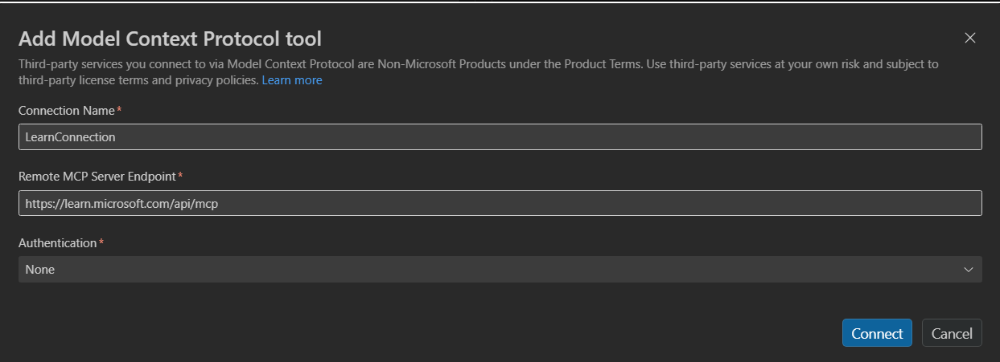
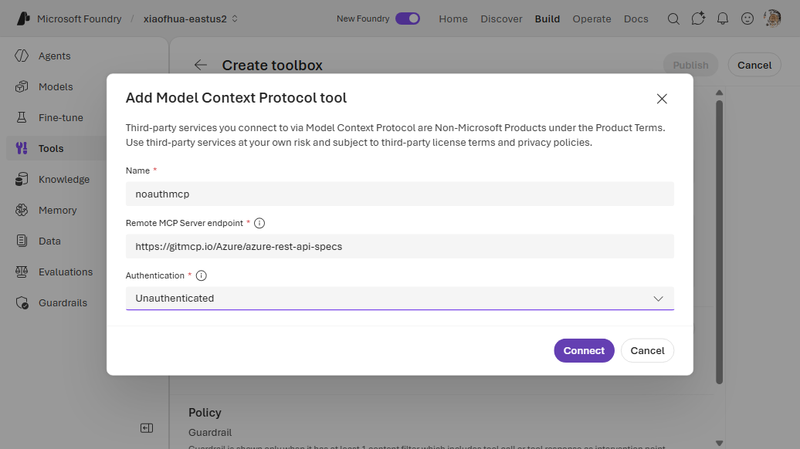
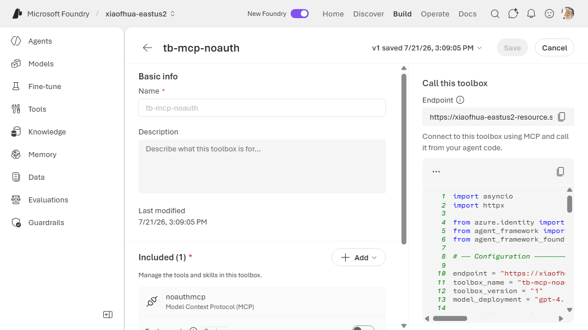

# 4. MCP — No Auth (public server)

Connect the agent to a **public MCP server** that requires no authentication. Foundry proxies the
server URL; no credentials are stored. The server URL is given inline on the tool — no connection
resource is needed.

**Connection required?** No. **Example server:** `https://learn.microsoft.com/api/mcp` (the
[Microsoft Learn MCP server](https://learn.microsoft.com/training/support/mcp), which exposes
Microsoft documentation search, doc fetch, and code-sample search).

---

## VS Code (Foundry Toolkit)

1. Open the **Foundry Toolkit** view from the **Activity Bar** and sign in. Under **Developer
   Tools** → **Discover**, open **Tool Catalog**. On the **Catalog** tab, under **Toolboxes**, click
   the **Create Your Toolbox** card to open **Build a Custom Toolbox**.

   
2. Under **Basic info**, enter a **Name** (e.g. `agent-tools`) and an optional description. In the
   **Included** panel, click **+ Add ▾** → **Add tools**.

   

3. In the **Select a tool** dialog, switch to the **Custom** tab. Under **Foundry Connection**,
   select **Model Context Protocol (MCP)**.

   

   In the **Add Model Context Protocol tool** dialog, enter a **Connection Name**, the **Remote MCP
   Server Endpoint** (e.g. `https://learn.microsoft.com/api/mcp`), and set **Authentication** to
   **None**. Click **Connect**.

   

   > To browse pre-listed remote MCP servers instead of pasting a URL, use the **Catalog** tab.
   >
   > 

4. Back on **Build a Custom Toolbox**, click **Publish**. The toolbox appears on the **Toolboxes**
   tab. Use the copy icon in the **Endpoint URL** column to copy the consumer MCP endpoint into your
   agent's `TOOLBOX_ENDPOINT` — or click **Scaffold code template** to generate a hosted agent
   wired to it.

   

---

## CLI — Way A (`toolbox.yaml`)

```yaml
# toolbox.yaml
description: public-mcp toolbox
tools:
  - type: mcp
    server_label: learn_mcp
    server_url: "https://learn.microsoft.com/api/mcp"
    require_approval: "never"
```

```bash
azd ai toolbox create agent-tools --from-file ./toolbox.yaml --project-endpoint "$FOUNDRY_PROJECT_ENDPOINT"
```

## CLI — Way B (`azure.yaml`)

```yaml
# azure.yaml
name: my-agent-project
services:
  agent-tools:
    host: azure.ai.toolbox
    tools:
      - type: mcp
        server_label: learn_mcp
        server_url: "https://learn.microsoft.com/api/mcp"
  my-agent:
    host: azure.ai.agent
    uses:
      - agent-tools
    environmentVariables:
      - name: TOOLBOX_NAME
        value: agent-tools
```

```bash
azd deploy agent-tools
```

---

## Portal (Foundry / Azure)

1. In the [Foundry portal](https://ai.azure.com/), open **Tools** → **Toolboxes** tab →
   **Create toolbox**. Give it a **Name**.
2. Under **Included**, click **+ Add** → **Add tool** → the **Custom** tab → **Model Context
   Protocol (MCP)** → **Create**.
3. In the **Add Model Context Protocol tool** dialog, enter a **Name** and the **Remote MCP Server
   endpoint**, and set **Authentication** to **Unauthenticated**. Click **Connect**.
4. Click **Publish** and copy the endpoint into `TOOLBOX_ENDPOINT`.





---

## Notes

- MCP tools are exposed to the agent as `{server_label}___{tool_name}` (three underscores). With the
  Microsoft Learn server and `server_label: learn_mcp`, the tools are
  `learn_mcp___microsoft_docs_search`, `learn_mcp___microsoft_docs_fetch`, and
  `learn_mcp___microsoft_code_sample_search`.

## References

- [MCP tool documentation](https://learn.microsoft.com/azure/foundry/agents/how-to/tools/model-context-protocol)
