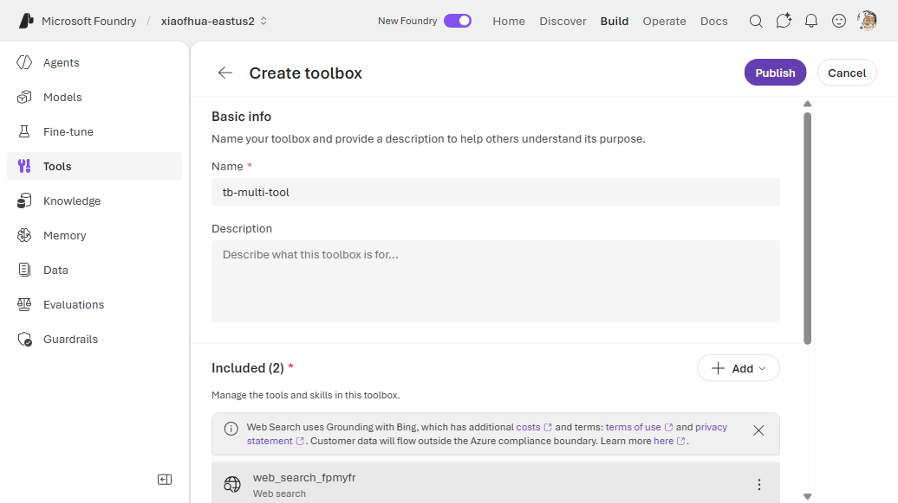
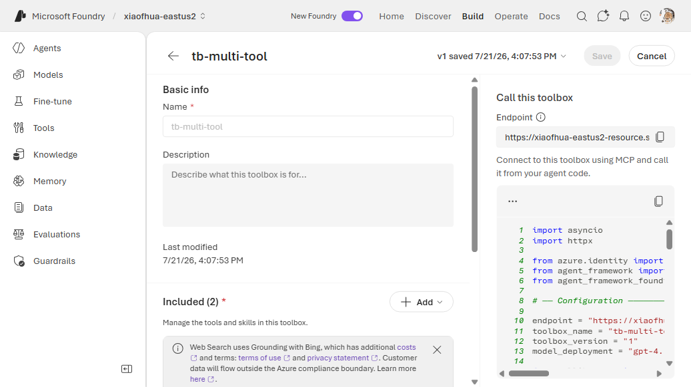

# 15. Multi-Tool Toolbox

Bundle **several tool types behind one endpoint** — the whole point of a toolbox. This example
combines basic web search with the GitHub MCP server (key auth). The agent sees all tools through a
single MCP endpoint.

**Connection required?** Only for the tools that need one (here: GitHub MCP → `CustomKeys`).

---

## The composition rule

**Across the whole toolbox, at most ONE tool may be unnamed.** Every other tool needs a `name`
(built-ins / `openapi`) or `server_label` (`mcp`). Two unnamed tools returns:

```
400 invalid_payload: Multiple tools without identifiers found.
```

So in a multi-tool toolbox, give **every** tool an identifier (safest), or leave exactly one
unnamed.

---

## 1. Create the connection (for GitHub MCP)

```bash
azd ai connection create ghmcppat \
  --kind remote-tool \
  --target https://api.githubcopilot.com/mcp \
  --auth-type custom-keys \
  --custom-key "Authorization=Bearer <github_pat>" \
  --project-endpoint "$FOUNDRY_PROJECT_ENDPOINT"
```

## 2a. CLI — Way A (`toolbox.yaml`)

```yaml
# toolbox.yaml
description: multi-tool toolbox (web search + GitHub MCP)
tools:
  - type: web_search
    name: web_search
    require_approval: "never"
  - type: mcp
    server_label: github
    project_connection_id: ghmcppat
    require_approval: "never"
```

```bash
azd ai toolbox create agent-tools --from-file ./toolbox.yaml --project-endpoint "$FOUNDRY_PROJECT_ENDPOINT"
```

## 2b. CLI — Way B (`azure.yaml`)

```yaml
# azure.yaml
name: my-agent-project
services:
  agent-tools:
    host: azure.ai.toolbox
    tools:
      - type: web_search
        name: web_search
      - type: mcp
        server_label: github
        project_connection_id: ghmcppat
  my-agent:
    host: azure.ai.agent
    uses:
      - agent-tools
    environmentVariables:
      - name: TOOLBOX_NAME
        value: agent-tools
```

```bash
azd deploy agent-tools
```

---

## Portal (Foundry / Azure)

1. In the [Foundry portal](https://ai.azure.com/), open **Tools** → **Toolboxes** tab →
   **Create toolbox**. Give it a **Name**.
2. Under **Included**, click **+ Add** → **Add tool** and add the first tool — e.g. **Web search**
   from the **Configured** tab → **Add tool**.
3. Click **+ Add** → **Add tool** again and add another tool — e.g. an **MCP server** from the
   **Custom** tab (**Model Context Protocol (MCP)**), configuring its endpoint and auth. Give each
   tool a distinct name.
4. Repeat for every tool, then click **Publish** and copy the endpoint into `TOOLBOX_ENDPOINT`.





## VS Code (Foundry Toolkit)

1. Open the **Microsoft Foundry** view and sign in.
2. Create needed connections.
3. **Tools** → **Toolboxes** → **Create toolbox** → add several tools, each with a unique
   name/label.


---

## Notes

- When a toolbox grows beyond ~5 tools, consider **Tool Search** so the model gets natural-language
  tool discovery instead of a long `tools/list`. See the
  [Tool Search docs](https://learn.microsoft.com/azure/foundry/agents/how-to/tools/tool-search).

## References

- [Toolbox — configure tools](https://learn.microsoft.com/azure/foundry/agents/how-to/tools/toolbox#configure-tools)
