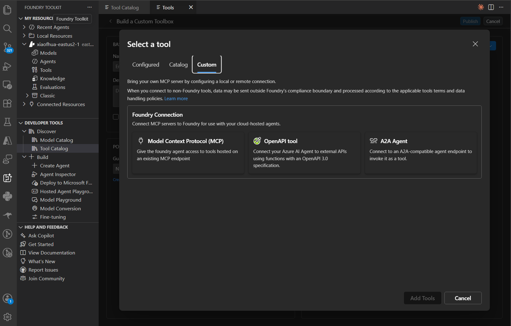
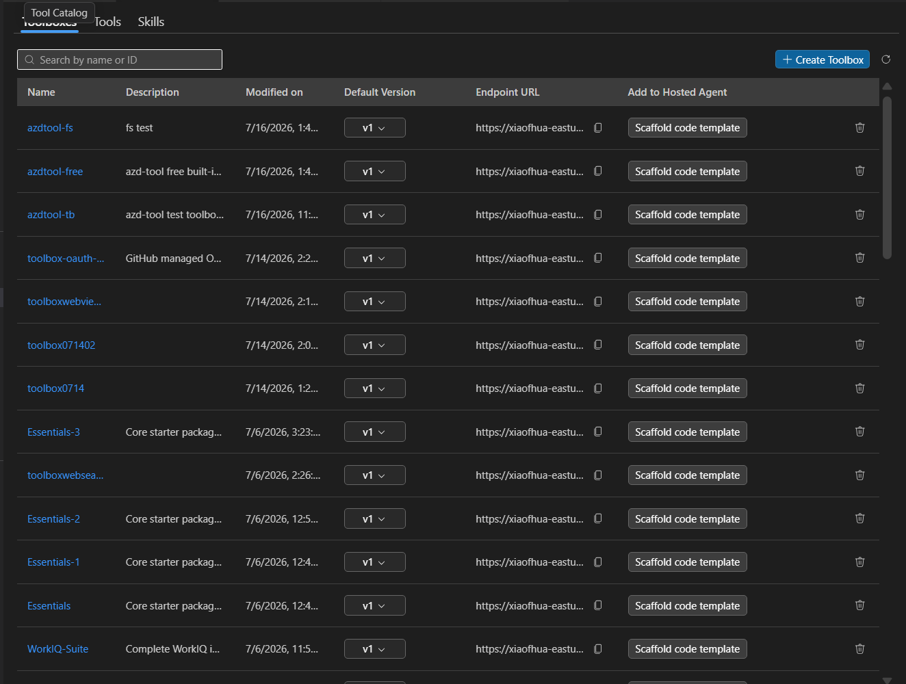
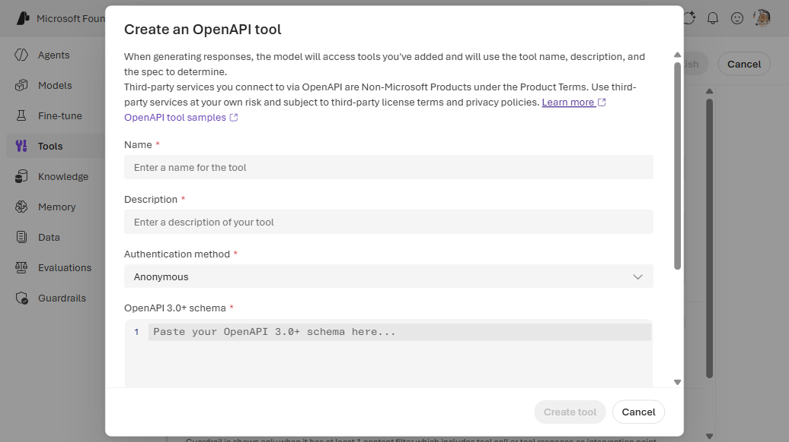
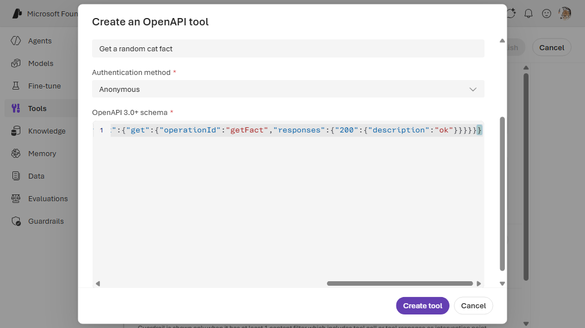
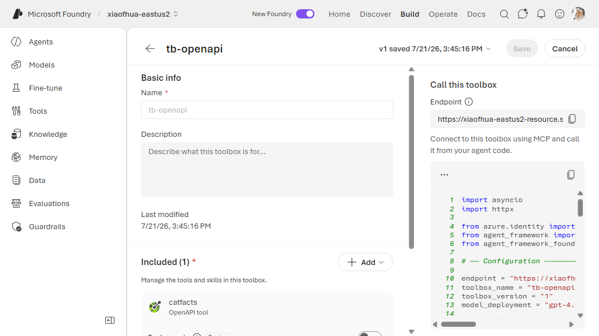

# 13. OpenAPI

Expose a REST API to the agent from its **OpenAPI 3.x spec**. The spec is embedded **inline** in the
toolbox tool entry. Three auth modes: **anonymous** (no connection), **API key** (a `CustomKeys`
connection), or **managed identity** (project MI + audience).

**Connection required?** Conditional — only for API-key auth. Each operation becomes a tool named
`{name}___{operationId}`, so every operation needs an `operationId`.

---

## VS Code (Foundry Toolkit)

1. Open the **Foundry Toolkit** view from the **Activity Bar** and sign in. Under **Developer
   Tools** → **Discover**, open **Tool Catalog**. On the **Catalog** tab, under **Toolboxes**, click
   the **Create Your Toolbox** card to open **Build a Custom Toolbox**.

   
2. Under **Basic info**, enter a **Name** (e.g. `agent-tools`) and an optional description. In the
   **Included** panel, click **+ Add ▾** → **Add tools**.

   

3. In the **Select a tool** dialog, switch to the **Custom** tab. Under **Foundry Connection**,
   select **OpenAPI tool**, then paste/upload the OpenAPI 3.x spec and choose the auth mode
   (anonymous / connection / managed identity). Click **Add Tools**.

   

4. Back on **Build a Custom Toolbox**, click **Publish**. The toolbox appears on the **Toolboxes**
   tab. Use the copy icon in the **Endpoint URL** column to copy the consumer MCP endpoint into your
   agent's `TOOLBOX_ENDPOINT` — or click **Scaffold code template** to generate a hosted agent
   wired to it.

   

---

## Auth modes

| Auth | `auth` object | Connection? |
|------|---------------|-------------|
| Anonymous | `{ type: anonymous }` | No |
| API key | `{ type: connection, connection_id: <conn> }` | Yes (`CustomKeys`; key name must match the spec's `securityScheme`) |
| Managed identity | `{ type: managed_identity, audience: <resource-uri> }` | No (grant project MI RBAC on the target) |

## 1. (API-key auth only) Create the connection

```bash
azd ai connection create myapiconn \
  --kind custom-keys \
  --target https://api.example.com \
  --custom-key "x-api-key=<api-key>" \
  --project-endpoint "$FOUNDRY_PROJECT_ENDPOINT"
```

## 2a. CLI — Way A (`toolbox.yaml`) — anonymous example

```yaml
# toolbox.yaml
description: openapi toolbox
tools:
  - type: openapi
    openapi:
      name: catfacts
      spec:
        openapi: "3.0.0"
        info: { title: Cat Facts, version: "1.0.0" }
        servers: [{ url: https://catfact.ninja }]
        paths:
          /fact:
            get:
              operationId: getFact
              responses: { "200": { description: ok } }
      auth:
        type: anonymous
```

```bash
azd ai toolbox create agent-tools --from-file ./toolbox.yaml --project-endpoint "$FOUNDRY_PROJECT_ENDPOINT"
```

For **API-key** auth, add `security` + `securitySchemes` to the spec (the scheme name must match the
connection key) and set:

```yaml
      auth:
        type: connection
        connection_id: myapiconn
```

For **managed identity**, use `auth: { type: managed_identity, audience: https://<resource-uri>/ }`
and grant the project MI RBAC on the target.

## 2b. CLI — Way B (`azure.yaml`)

```yaml
# azure.yaml
name: my-agent-project
services:
  agent-tools:
    host: azure.ai.toolbox
    tools:
      - type: openapi
        openapi:
          name: catfacts
          spec:
            openapi: "3.0.0"
            info: { title: Cat Facts, version: "1.0.0" }
            servers: [{ url: https://catfact.ninja }]
            paths:
              /fact:
                get:
                  operationId: getFact
                  responses: { "200": { description: ok } }
          auth:
            type: anonymous
  my-agent:
    host: azure.ai.agent
    uses:
      - agent-tools
    environmentVariables:
      - name: TOOLBOX_NAME
        value: agent-tools
```

```bash
azd deploy agent-tools
```

---

## Portal (Foundry / Azure)

1. In the [Foundry portal](https://ai.azure.com/), open **Tools** → **Toolboxes** tab →
   **Create toolbox**. Give it a **Name**.
2. Under **Included**, click **+ Add** → **Add tool** → the **Custom** tab → **OpenAPI tool** →
   **Create**.
3. In the dialog, paste/upload the OpenAPI spec and choose the auth mode (anonymous / connection /
   managed identity). Click **Connect**.
4. Click **Publish** and copy the endpoint into `TOOLBOX_ENDPOINT`.







---

## Notes

- Every operation needs an `operationId` (letters, `-`, `_` only).
- Multiple `openapi` entries in one toolbox are allowed only if each spec has a distinct
  `info.title`.

## References

- [OpenAPI tool documentation](https://learn.microsoft.com/azure/foundry/agents/how-to/tools/openapi)
