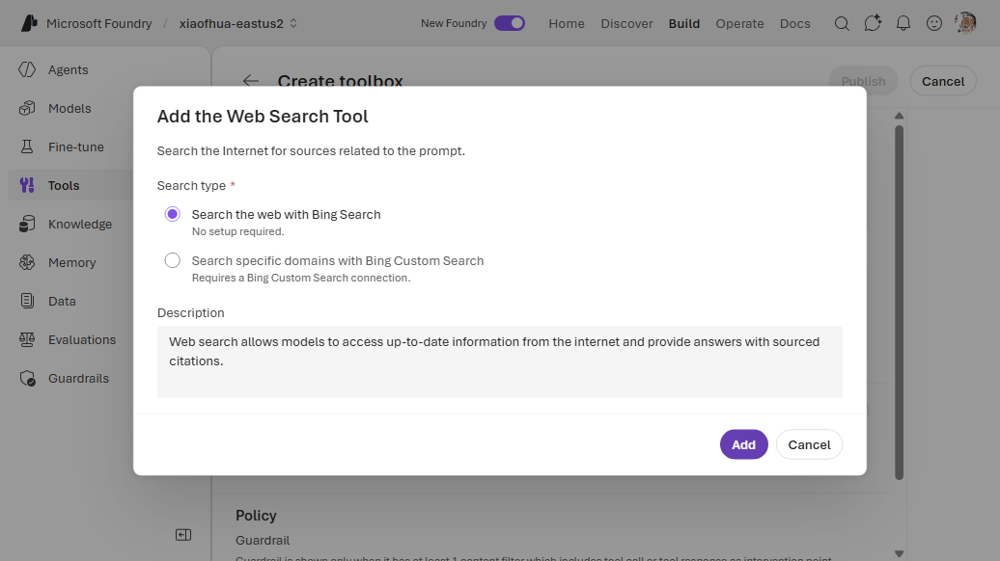
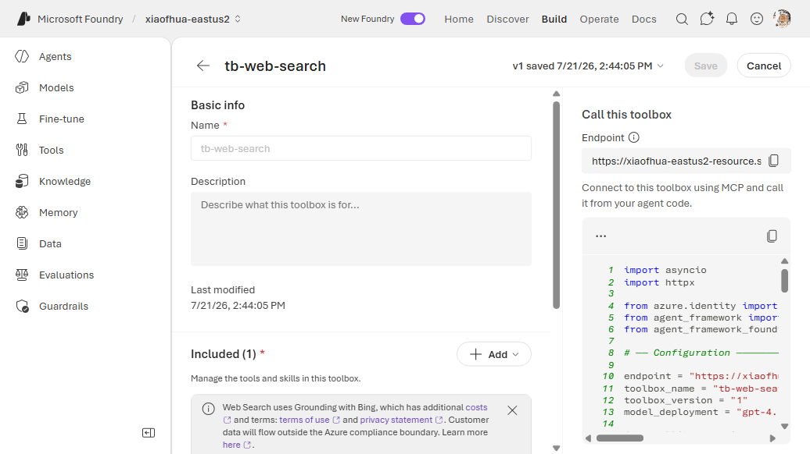

# 1. Web Search (basic Bing)

Grounds agent responses in real-time public web results via Grounding with Bing Search. This is a
**connectionless built-in** — the simplest toolbox scenario. No connection or secrets required.

---

## VS Code (Foundry Toolkit)

1. Open the **Foundry Toolkit** view from the **Activity Bar** and sign in. Under **Developer
   Tools** → **Discover**, open **Tool Catalog**. On the **Catalog** tab, under **Toolboxes**, click
   the **Create Your Toolbox** card to open **Build a Custom Toolbox**.

   
2. Under **Basic info**, enter a **Name** (e.g. `agent-tools`) and an optional description. In the
   **Included** panel, click **+ Add ▾** → **Add tools**.

   

3. In the **Select a tool** dialog, stay on the **Configured** tab. Under **Foundry Tools**, select
   the **Web search** card (Built-in · Microsoft Foundry) — no connection is needed — then click
   **Add Tools**.

   

4. Back on **Build a Custom Toolbox**, click **Publish**. The toolbox appears on the **Toolboxes**
   tab. Use the copy icon in the **Endpoint URL** column to copy the consumer MCP endpoint into your
   agent's `TOOLBOX_ENDPOINT` — or click **Scaffold code template** to generate a hosted agent
   wired to it.

   

---

## CLI — Way A (`toolbox.yaml`)

```yaml
# toolbox.yaml
description: web-search toolbox
tools:
  - type: web_search
    name: web_search
    require_approval: "never"
```

```bash
azd ai toolbox create agent-tools --from-file ./toolbox.yaml --project-endpoint "$FOUNDRY_PROJECT_ENDPOINT"
```

## CLI — Way B (`azure.yaml`)

Declare the toolbox as a service alongside the agent; `azd deploy` upserts it.

```yaml
# azure.yaml
name: my-agent-project
services:
  agent-tools:
    host: azure.ai.toolbox
    tools:
      - type: web_search
        name: web_search
  my-agent:
    host: azure.ai.agent
    uses:
      - agent-tools
    environmentVariables:
      - name: TOOLBOX_NAME
        value: agent-tools
```

```bash
azd deploy agent-tools
```

---

## Portal (Foundry / Azure)

1. Open the [Foundry portal](https://ai.azure.com/) and select your project.
2. In the left nav, open **Tools**, select the **Toolboxes** tab, then click **Create toolbox**.
3. Under **Basic info**, give the toolbox a **Name** (e.g. `agent-tools`).
4. Under **Included**, click **+ Add** → **Add tool** to open the **Select a tool** dialog.
5. On the **Configured** tab, select **Web search** (Grounding with Bing Search) — no connection is
   needed — then click **Add tool**.
6. Click **Publish**. Copy the consumer MCP endpoint into your agent's `TOOLBOX_ENDPOINT`.





---

## Notes

- Basic Bing needs no connection. To **scope** search to specific domains, use
  [Bing Custom Search](bing-custom-search.md) instead (which does need a connection).

## References

- [Web Search tool documentation](https://learn.microsoft.com/azure/foundry/agents/how-to/tools/web-search)
- [Web Search vs Grounding with Bing Search](https://learn.microsoft.com/azure/foundry/agents/how-to/tools/web-overview)
