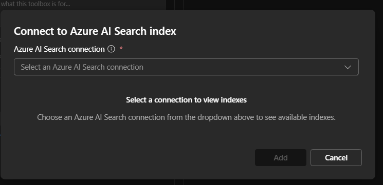
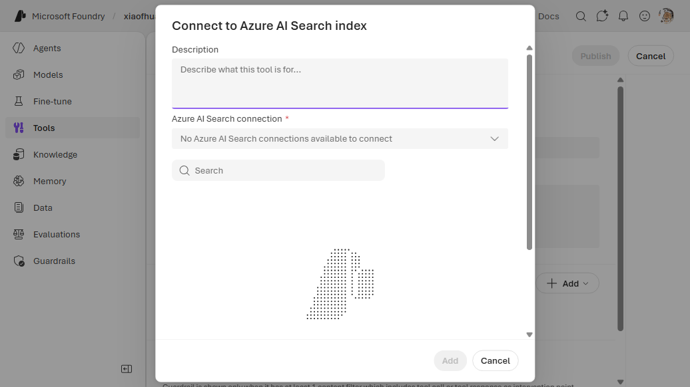

# 10. Azure AI Search

Query an existing **Azure AI Search** index from the agent. The search service credentials live in
a `CognitiveSearch` connection (`ApiKey`); the toolbox references it and the index name.

**Prerequisite:** an existing search service + index — see
[Create an Azure AI Search service](https://learn.microsoft.com/azure/search/search-create-service-portal).

---

## VS Code (Foundry Toolkit)

1. In the **Foundry Toolkit** view (signed in), open **Tool Catalog** → **Catalog** tab → **Toolboxes** → **Create Your Toolbox**.

   
2. Enter a toolbox **Name** and description, then in the **Included** panel click **+ Add ▾** → **Add tools**.

   
3. In the **Select a tool** dialog, stay on the **Configured** tab. Select the **Azure AI Search** card, pick (or create) a connection and choose the **index**, then click **Add Tools**.

   
4. Back on **Build a Custom Toolbox**, click **Publish**, then use the copy icon in the **Endpoint
   URL** column to copy the endpoint into your agent's `TOOLBOX_ENDPOINT`.

   

---

## CLI (`azd`)

### 1. Create the connection

```bash
azd ai connection create aisearchconn \
  --kind cognitive-search \
  --target "https://<my-search>.search.windows.net/" \
  --auth-type api-key \
  --api-key "<ai_search_admin_key>" \
  --project-endpoint "$FOUNDRY_PROJECT_ENDPOINT"
```

### 2a. Way A (`toolbox.yaml`)

```yaml
# toolbox.yaml
description: ai-search toolbox
tools:
  - type: azure_ai_search
    name: azure_ai_search
    index_name: "<your_index_name>"
    project_connection_id: aisearchconn
    require_approval: "never"
```

```bash
azd ai toolbox create agent-tools --from-file ./toolbox.yaml --project-endpoint "$FOUNDRY_PROJECT_ENDPOINT"
```

### 2b. Way B (`azure.yaml`)

```yaml
# azure.yaml
name: my-agent-project
services:
  agent-tools:
    host: azure.ai.toolbox
    tools:
      - type: azure_ai_search
        name: azure_ai_search
        index_name: "<your_index_name>"
        project_connection_id: aisearchconn
  my-agent:
    host: azure.ai.agent
    uses:
      - agent-tools
    environmentVariables:
      - name: TOOLBOX_NAME
        value: agent-tools
```

```bash
azd deploy agent-tools
```

---

## Portal (Foundry / Azure)

1. In the [Foundry portal](https://ai.azure.com/), open **Tools** → **Toolboxes** tab →
   **Create toolbox**. Give it a **Name**.
2. Under **Included**, click **+ Add** → **Add tool**. On the **Configured** tab, select **Azure AI
   search**, then **Add tool**.

   
3. In the **Connect to Azure AI Search index** dialog, pick an existing **Azure AI Search
   connection**. If you have none, click **connect to a new resource** → **Create a new connection**:
   choose an existing Search service (Auth Type **API Key**), or click **Create a new resource** to
   provision one in the Azure portal (see box below). Then select the **index** from the list.

   
4. Click **Add tool**, then **Publish**, and copy the endpoint into `TOOLBOX_ENDPOINT`.

   


## Notes

- For multiple indexes, add one `azure_ai_search` entry per index (each needs a unique `name`).

## References

- [Azure AI Search tool documentation](https://learn.microsoft.com/azure/foundry/agents/how-to/tools/azure-ai-search)
