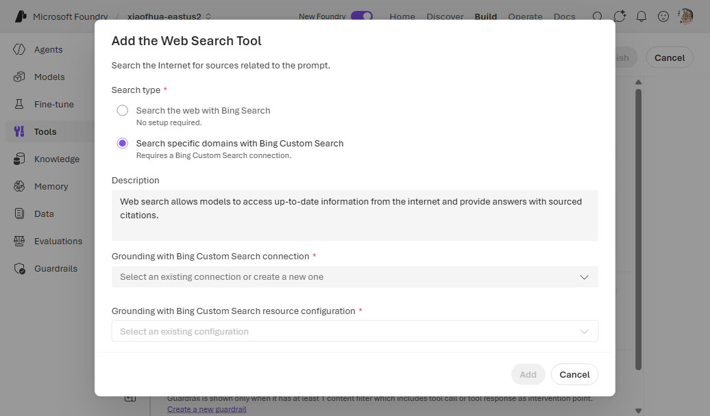

# 12. Bing Custom Search

Like [web search](built-in-web-search.md), but **scoped to specific domains** via a Bing Custom Search
instance. Uses a `GroundingWithCustomSearch` connection plus a custom-search configuration on the
`web_search` tool.

**Prerequisite:** a Bing Custom Search instance + a Bing account resource ID — see
[Grounding with Bing Custom Search setup](https://learn.microsoft.com/azure/ai-foundry/agents/how-to/tools/bing-custom-search).

---

## CLI (`azd`)

### 1. Create the connection

```bash
azd ai connection create bingcustomconn \
  --kind grounding-with-custom-search \
  --target https://api.bing.microsoft.com/ \
  --auth-type api-key \
  --api-key "<bing_api_key>" \
  --metadata "ResourceId=<bing_resource_id>" \
  --metadata "type=bing_custom_search_preview" \
  --project-endpoint "$FOUNDRY_PROJECT_ENDPOINT"
```

### 2a. Way A (`toolbox.yaml`)

```yaml
# toolbox.yaml
description: bing-custom-search toolbox
tools:
  - type: web_search
    name: web_search
    custom_search_configuration:
      instance_name: "<bing_custom_instance>"
      project_connection_id: bingcustomconn
    require_approval: "never"
```

```bash
azd ai toolbox create agent-tools --from-file ./toolbox.yaml --project-endpoint "$FOUNDRY_PROJECT_ENDPOINT"
```

### 2b. Way B (`azure.yaml`)

```yaml
# azure.yaml
name: my-agent-project
services:
  agent-tools:
    host: azure.ai.toolbox
    tools:
      - type: web_search
        name: web_search
        custom_search_configuration:
          instance_name: "<bing_custom_instance>"
          project_connection_id: bingcustomconn
  my-agent:
    host: azure.ai.agent
    uses:
      - agent-tools
    environmentVariables:
      - name: TOOLBOX_NAME
        value: agent-tools
```

```bash
azd deploy agent-tools
```

---

## Portal (Foundry / Azure)

1. In the [Foundry portal](https://ai.azure.com/), open **Tools** → **Toolboxes** tab →
   **Create toolbox**. Give it a **Name**.
2. Under **Included**, click **+ Add** → **Add tool**. On the **Configured** tab, select **Web
   search**, then **Add tool**.
3. In the **Add the Web Search Tool** dialog, set **Search type** to **Search specific domains with
   Bing Custom Search**. Under **Grounding with Bing Custom Search connection**, pick an existing
   connection or **Connect to a new resource**; then select the **resource configuration**
   (instance).

   
4. Click **Add**, then **Publish**, and copy the endpoint into `TOOLBOX_ENDPOINT`.

   

## Notes

- For unscoped public web search with no connection, use [basic web search](built-in-web-search.md).

## References

- [Web Search / Grounding with Bing Custom Search](https://learn.microsoft.com/azure/foundry/agents/how-to/tools/web-overview)
