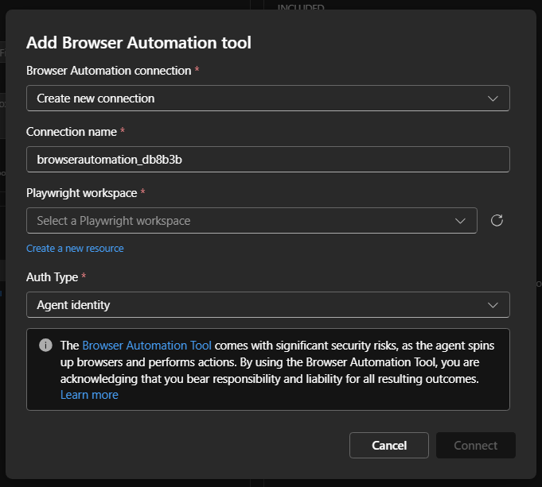
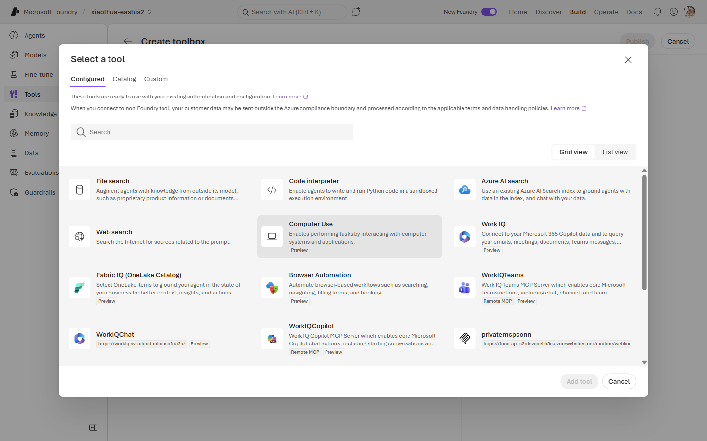
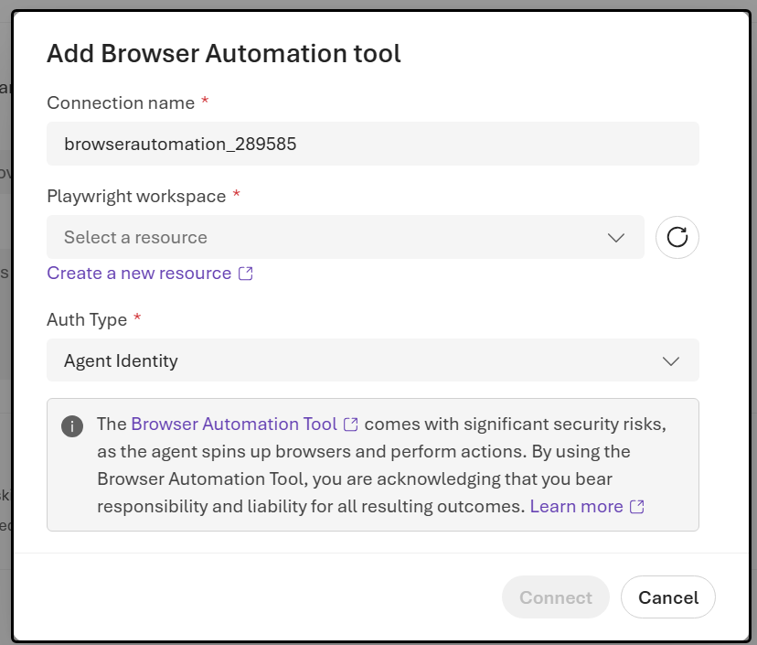

# 14. Browser Automation

Let the agent drive a real browser (navigate, click, fill forms, extract) via an **Azure Playwright
workspace**. The workspace credentials live in a `PlaywrightWorkspace` connection using project
managed identity.

**Prerequisite:** an Azure Playwright workspace — see
[Create a Playwright Workspace](https://aka.ms/pww/docs/manage-workspaces).

---

## VS Code (Foundry Toolkit)

1. In the **Foundry Toolkit** view (signed in), open **Tool Catalog** → **Catalog** tab → **Toolboxes** → **Create Your Toolbox**.

   
2. Enter a toolbox **Name** and description, then in the **Included** panel click **+ Add ▾** → **Add tools**.

   
3. In the **Select a tool** dialog, stay on the **Configured** tab. Select the **Browser Automation** card, pick (or create) a **Playwright workspace** connection, then click **Add Tools**.

   
4. Back on **Build a Custom Toolbox**, click **Publish**, then use the copy icon in the **Endpoint
   URL** column to copy the endpoint into your agent's `TOOLBOX_ENDPOINT`.

   

---

## CLI (`azd`)

### 1. Create the connection

```bash
azd ai connection create browserautomation \
  --kind playwright-workspace \
  --target "<playwright_service_url>" \
  --auth-type project-managed-identity \
  --metadata "resourceId=<playwright_service_resource_id>" \
  --project-endpoint "$FOUNDRY_PROJECT_ENDPOINT"
```

### 2a. Way A (`toolbox.yaml`)

```yaml
# toolbox.yaml
description: browser-automation toolbox
tools:
  - type: browser_automation_preview
    name: browser_automation
    browser_automation_preview:
      connection:
        project_connection_id: browserautomation
    require_approval: "never"
```

```bash
azd ai toolbox create agent-tools --from-file ./toolbox.yaml --project-endpoint "$FOUNDRY_PROJECT_ENDPOINT"
```

### 2b. Way B (`azure.yaml`)

```yaml
# azure.yaml
name: my-agent-project
services:
  agent-tools:
    host: azure.ai.toolbox
    tools:
      - type: browser_automation_preview
        name: browser_automation
        browser_automation_preview:
          connection:
            project_connection_id: browserautomation
  my-agent:
    host: azure.ai.agent
    uses:
      - agent-tools
    environmentVariables:
      - name: TOOLBOX_NAME
        value: agent-tools
```

```bash
azd deploy agent-tools
```

---

## Portal (Foundry / Azure)

1. In the [Azure portal](https://portal.azure.com/), create an **Azure Playwright workspace** (if
   you don't have one) and note its endpoint + resource ID.
2. In the [Foundry portal](https://ai.azure.com/), open **Tools** → **Toolboxes** tab →
   **Create toolbox**. Give it a **Name**.
3. Under **Included**, click **+ Add** → **Add tool**. On the **Configured** tab, select **Browser
   Automation**.

   
4. Provide the Playwright workspace connection (endpoint + resource ID), then click **Add tool**.

   
5. Click **Publish** and copy the endpoint into `TOOLBOX_ENDPOINT`.

   

---

## Notes

- `browser_automation_preview` is a preview tool type and requires an Azure Playwright workspace.


## References

- [Browser automation tool documentation](https://learn.microsoft.com/azure/foundry/agents/how-to/tools/browser-automation)
