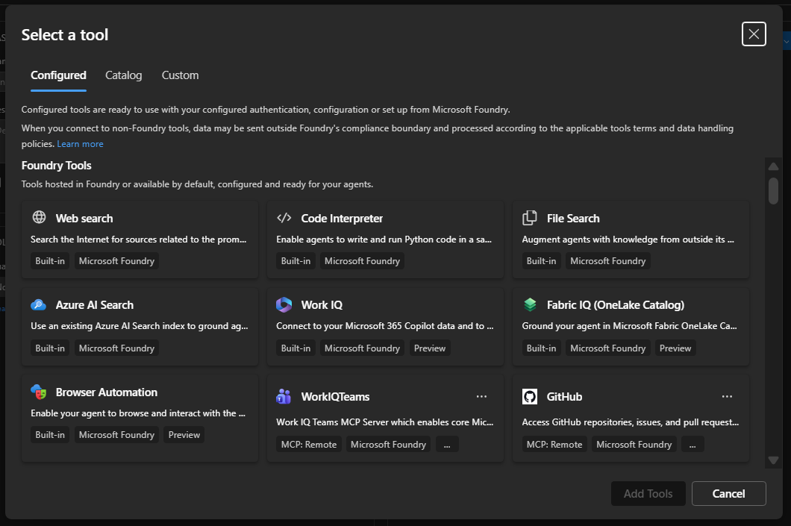
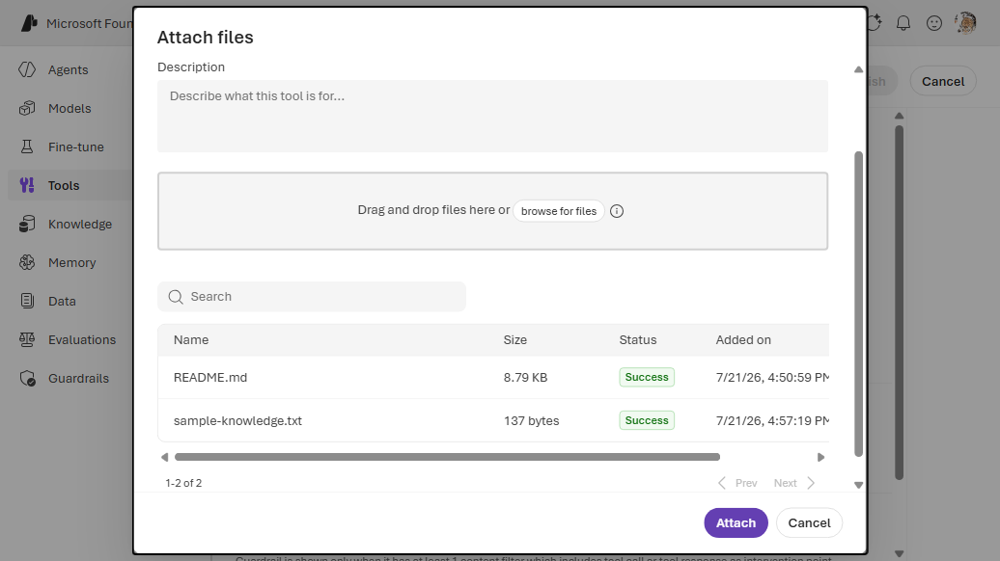

# 2. File Search (vector store)

Retrieval over files you've uploaded to an Azure AI Foundry **vector store**. The vector store must
already exist in the **same Foundry project**. This is a connectionless built-in — the vector store
is referenced by ID, not through a connection.

**Prerequisite:** an existing vector store ID (e.g. `vs_xxxxxxxxxxxx`) with at least one indexed
file. If you don't have one yet, create it first — see [Prerequisites](#prerequisites) below.


## VS Code (Foundry Toolkit)

1. In the **Foundry Toolkit** view (signed in), open **Tool Catalog** → **Catalog** tab → **Toolboxes** → **Create Your Toolbox**.

   
2. Enter a toolbox **Name** and description, then in the **Included** panel click **+ Add ▾** → **Add tools**.

   

3. In the **Select a tool** dialog, stay on the **Configured** tab. Select the **File Search** card, provide the vector store ID (from the same project), then click **Add Tools**.

   

4. Back on **Build a Custom Toolbox**, click **Publish**. The toolbox appears on the **Toolboxes**
   tab. Use the copy icon in the **Endpoint URL** column to copy the consumer MCP endpoint into your
   agent's `TOOLBOX_ENDPOINT` — or click **Scaffold code template** to generate a hosted agent
   wired to it.

   

---

## CLI (`azd`)

### 1. Create the vector store

The vector store is a **data-plane** resource — call the project endpoint with API version `v1` and
the auth resource `https://ai.azure.com`. A file must finish indexing (`file_counts.completed >= 1`)
before search returns results.

```bash
EP="$FOUNDRY_PROJECT_ENDPOINT"                       # https://<account>.services.ai.azure.com/api/projects/<project>
TOK=$(az account get-access-token --resource https://ai.azure.com --query accessToken -o tsv)

# 1. Create the vector store — note the returned id (vs_...).
VS_ID=$(curl -s -X POST "$EP/vector_stores?api-version=v1" \
  -H "Authorization: Bearer $TOK" -H "Content-Type: application/json" \
  -d '{"name":"my-vector-store"}' | jq -r .id)

# 2. Upload a file (purpose=assistants) — note the returned id (assistant-...).
FILE_ID=$(curl -s -X POST "$EP/files?api-version=v1" \
  -H "Authorization: Bearer $TOK" \
  -F "purpose=assistants" -F "file=@./my-doc.txt" | jq -r .id)

# 3. Attach the file to the vector store (starts indexing).
curl -s -X POST "$EP/vector_stores/$VS_ID/files?api-version=v1" \
  -H "Authorization: Bearer $TOK" -H "Content-Type: application/json" \
  -d "{\"file_id\":\"$FILE_ID\"}"

# 4. Poll until indexed — wait for file_counts.completed to reach 1.
curl -s "$EP/vector_stores/$VS_ID?api-version=v1" \
  -H "Authorization: Bearer $TOK" | jq .file_counts
```

Use the resulting `vs_...` id as the `vector_store_ids` entry in the toolbox below.

| Gotcha | Detail |
|--------|--------|
| Auth resource | Use `https://ai.azure.com` for the token, **not** an ARM/management scope, or you get `401`. |
| API version | The data-plane vector store API uses `api-version=v1`, not an ARM-style date version. |
| Empty store | Search returns no results until a file finishes indexing (`file_counts.completed >= 1`). |
| Same project | The vector store must live in the **same project** as the toolbox. |

### 2a. Way A (`toolbox.yaml`)

```yaml
# toolbox.yaml
description: file-search toolbox
tools:
  - type: file_search
    name: file_search
    vector_store_ids:
      - "vs_xxxxxxxxxxxx"     # flat: sibling of type, NOT nested under file_search
    require_approval: "never"
```

```bash
azd ai toolbox create agent-tools --from-file ./toolbox.yaml --project-endpoint "$FOUNDRY_PROJECT_ENDPOINT"
```

### 2b. Way B (`azure.yaml`)

```yaml
# azure.yaml
name: my-agent-project
services:
  agent-tools:
    host: azure.ai.toolbox
    tools:
      - type: file_search
        name: file_search
        vector_store_ids:
          - "vs_xxxxxxxxxxxx"
  my-agent:
    host: azure.ai.agent
    uses:
      - agent-tools
    environmentVariables:
      - name: TOOLBOX_NAME
        value: agent-tools
```

```bash
azd deploy agent-tools
```

---

## Portal (Foundry / Azure)

1. First create/populate a vector store: in the [Foundry portal](https://ai.azure.com/), go to
   **Data** → **Vector stores** → upload files. Copy the vector store ID.
2. Open **Tools** → **Toolboxes** tab → **Create toolbox**. Give it a **Name**.
3. Under **Included**, click **+ Add** → **Add tool**. On the **Configured** tab, select **File search**.
4. Upload your files, then click **Add tool**.
  
5. Click **Publish** and copy the endpoint into `TOOLBOX_ENDPOINT`.
  

---

## Notes

- `vector_store_ids` is a **flat** sibling of `type` — do **not** nest it under a `file_search:`
  object.
- The vector store must live in the **same project** as the toolbox.
- When calling the tool over MCP, the argument is `queries` (an **array** of strings), e.g.
  `{"queries": ["what is the refund policy?"]}`.

## References

- [File Search tool documentation](https://learn.microsoft.com/azure/foundry/agents/how-to/tools/file-search)
