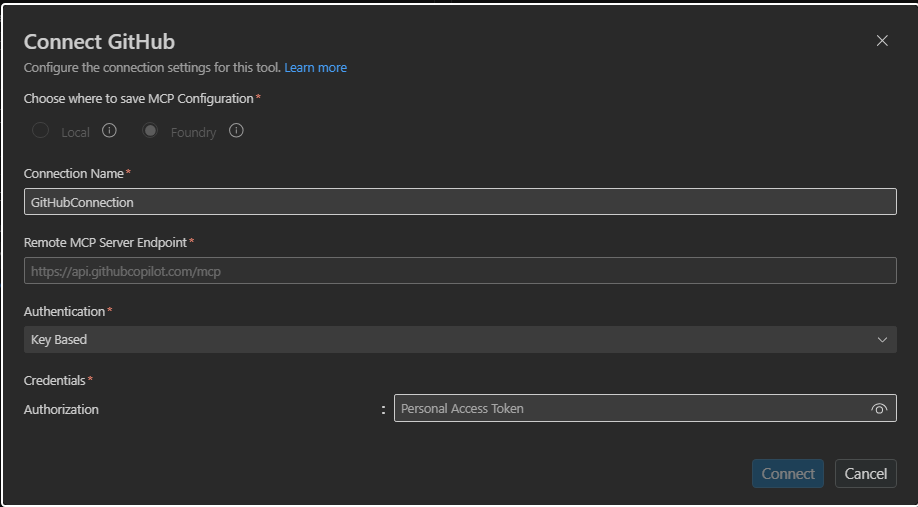

# 5. MCP — Key Auth (GitHub PAT)

Connect to an MCP server that authenticates with a **static key** — for example the GitHub MCP
server with a Personal Access Token injected as a Bearer token. The key is stored in a **connection**
(`CustomKeys`); the toolbox references the connection by name.

---

## VS Code (Foundry Toolkit)

1. In the **Foundry Toolkit** view (signed in), open **Tool Catalog** → **Catalog** tab → **Toolboxes** → **Create Your Toolbox**.

   
2. Enter a toolbox **Name** and description, then in the **Included** panel click **+ Add ▾** → **Add tools**.

   

3. In the **Select a tool** dialog, on the **Catalog** tab search for **GitHub** and select the **GitHub** tile (Remote MCP) → **Create** (for a non-catalog server, use the **Custom** tab → **Model Context Protocol (MCP)** and enter the endpoint yourself). In the config dialog, keep **Authentication = Key-based** and paste your Personal Access Token under **Authorization → Bearer**, then **Connect**.

   

4. Back on **Build a Custom Toolbox**, click **Publish**. The toolbox appears on the **Toolboxes**
   tab. Use the copy icon in the **Endpoint URL** column to copy the consumer MCP endpoint into your
   agent's `TOOLBOX_ENDPOINT` — or click **Scaffold code template** to generate a hosted agent
   wired to it.

   

---

## CLI (`azd`)

### 1. Create the connection

```bash
azd ai connection create ghmcppat \
  --kind remote-tool \
  --target https://api.githubcopilot.com/mcp \
  --auth-type custom-keys \
  --custom-key "Authorization=Bearer <github_pat>" \
  --project-endpoint "$FOUNDRY_PROJECT_ENDPOINT"
```

> `<github_pat>` — a classic `ghp_...` or fine-grained `github_pat_...` token.

### 2a. Way A (`toolbox.yaml`)

```yaml
# toolbox.yaml
description: github-mcp toolbox
tools:
  - type: mcp
    server_label: github
    project_connection_id: ghmcppat
    require_approval: "never"
```

```bash
azd ai toolbox create agent-tools --from-file ./toolbox.yaml --project-endpoint "$FOUNDRY_PROJECT_ENDPOINT"
```

### 2b. Way B (`azure.yaml`)

```yaml
# azure.yaml
name: my-agent-project
services:
  agent-tools:
    host: azure.ai.toolbox
    tools:
      - type: mcp
        server_label: github
        project_connection_id: ghmcppat
  my-agent:
    host: azure.ai.agent
    uses:
      - agent-tools
    environmentVariables:
      - name: TOOLBOX_NAME
        value: agent-tools
```

```bash
azd deploy agent-tools
```

---

## Portal (Foundry / Azure)

1. In the [Foundry portal](https://ai.azure.com/), open **Tools** → **Toolboxes** tab →
   **Create toolbox**. Give it a **Name**.
2. Under **Included**, click **+ Add** → **Add tool**. On the **Catalog** tab, search for **GitHub**
   and select the **GitHub** tile (Remote MCP) → **Create** (for a non-catalog server, use the
   **Custom** tab → **Model Context Protocol (MCP)** and enter the endpoint yourself).

3. In the **Connect the GitHub tool** dialog, the **Remote MCP Server endpoint**
   (`https://api.githubcopilot.com/mcp`) and **Authentication = Key-based** are pre-filled. Under
   **Authorization → Bearer**, paste your GitHub Personal Access Token. Click **Connect**.

   
4. Click **Publish** and copy the endpoint into `TOOLBOX_ENDPOINT`.

   


---

## References

- [MCP tool documentation](https://learn.microsoft.com/azure/foundry/agents/how-to/tools/model-context-protocol)
- [Project connections](https://learn.microsoft.com/azure/ai-foundry/how-to/connections-add)
