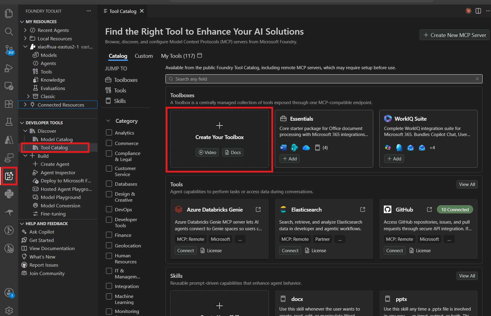
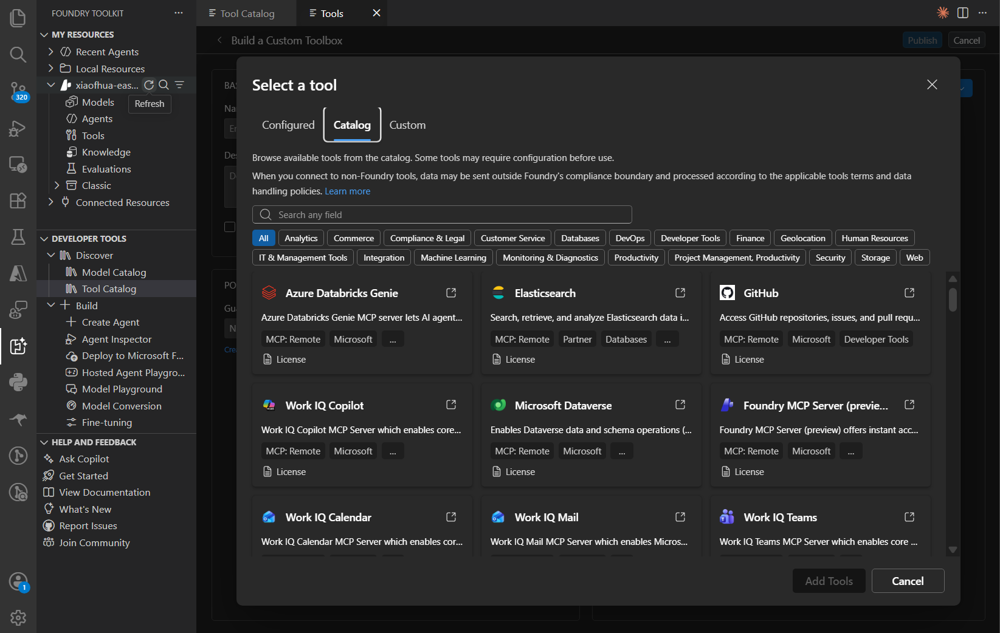
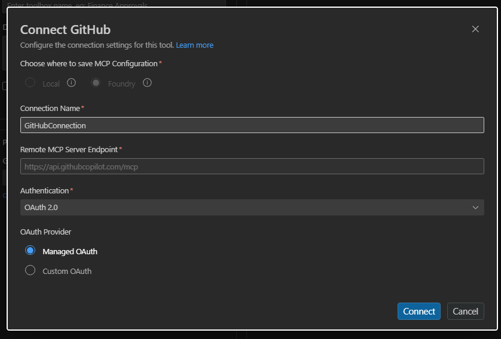
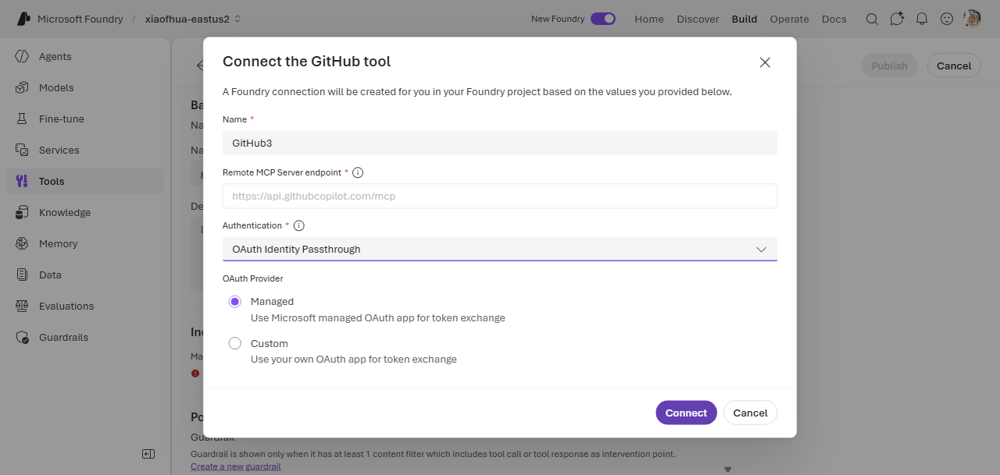
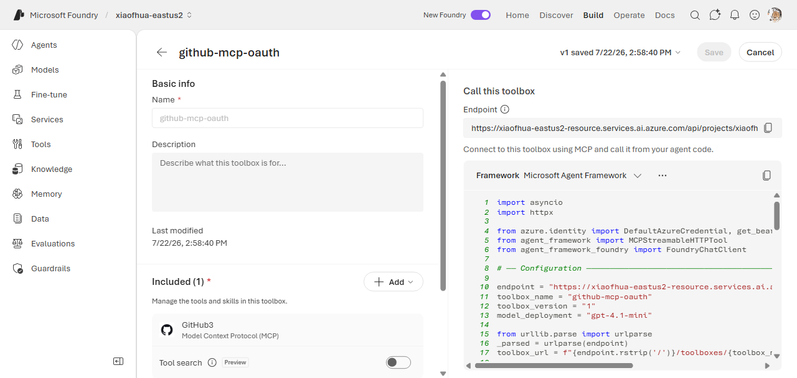

# 6. MCP — OAuth Identity Passthrough (Managed connector)

Connect to an MCP server via OAuth2 where **Foundry manages the app registration** — you supply no
client ID or secret. The first tool invocation returns a **consent URL** open it, consent, and retry.

**Example server:** GitHub
(`https://api.githubcopilot.com/mcp`, connector `foundrygithubmcp`).

> **Managed vs. custom OAuth.** With a *managed* connector, Foundry owns the OAuth app, so there's
> nothing to register — no Client ID, secret, Auth/Token URL, scopes, or reply URL. If you need to
> bring your own app registration instead (custom scopes, your own tenant/branding, or a non-catalog
> server), use [MCP OAuth custom app](mcp-oauth-custom.md).

---

## VS Code (Foundry Toolkit)

1. In the **Foundry Toolkit** view (signed in), open **Tool Catalog** → **Catalog** tab → **Toolboxes** → **Create Your Toolbox**.

   
2. Enter a toolbox **Name** and description, then in the **Included** panel click **+ Add ▾** →
   **Add tools**, then on the **Catalog** tab select **GitHub**.

   
   
3. In the connect dialog, set **Authentication** to **OAuth Identity Passthrough** with the
   **Managed** provider — no Client ID or secret. Click **Connect**.

   
4. Back on **Build a Custom Toolbox**, click **Publish**. The toolbox appears on the **Toolboxes**
   tab; copy the consumer MCP endpoint from the **Endpoint URL** column into your agent's
   `TOOLBOX_ENDPOINT` — or click **Scaffold code template**.

   

---

## CLI (`azd`)

### 1. Create the connection

```bash
azd ai connection create ghmcpoauth \
  --kind remote-tool \
  --target https://api.githubcopilot.com/mcp \
  --auth-type oauth2 \
  --connector-name foundrygithubmcp \
  --project-endpoint "$FOUNDRY_PROJECT_ENDPOINT"
```

> `--connector-name` names the Foundry-managed OAuth connector (`foundrygithubmcp` for GitHub). No
> `--client-id` / `--client-secret` / `--scopes` — Foundry supplies them. Swap `--target` and
> `--connector-name` for another catalog server.

### 2a. Way A (`toolbox.yaml`)

```yaml
# toolbox.yaml
description: github-mcp-oauth toolbox
tools:
  - type: mcp
    server_label: github
    project_connection_id: ghmcpoauth
    require_approval: "never"
```

```bash
azd ai toolbox create agent-tools --from-file ./toolbox.yaml --project-endpoint "$FOUNDRY_PROJECT_ENDPOINT"
```

### 2b. Way B (`azure.yaml`)

```yaml
# azure.yaml
name: my-agent-project
services:
  agent-tools:
    host: azure.ai.toolbox
    tools:
      - type: mcp
        server_label: github
        project_connection_id: ghmcpoauth
  my-agent:
    host: azure.ai.agent
    uses:
      - agent-tools
    environmentVariables:
      - name: TOOLBOX_NAME
        value: agent-tools
```

```bash
azd deploy agent-tools
```

---

## Portal (Foundry / Azure)

For a managed connector, add the server from the **Catalog** tab (e.g. **GitHub**) — not the
**Custom** tab. The Custom tab is the bring-your-own-app path that collects Client ID / secret (see
[MCP OAuth custom app](mcp-oauth-custom.md)).

1. In the [Foundry portal](https://ai.azure.com/), open **Tools** → **Toolboxes** tab →
   **Create toolbox**. Give it a **Name**.
2. Under **Included**, click **+ Add** → **Add tool** → the **Catalog** tab. Find and select
   **GitHub**, then **Create**.
3. In the **Connect the GitHub tool** dialog, the **Remote MCP Server endpoint** is prefilled. Set
   **Authentication** to **OAuth Identity Passthrough** and leave **OAuth Provider** on **Managed**
   ("Use Microsoft managed OAuth app for token exchange") — no Client ID or secret required. Click
   **Connect**.

   
4. The tool appears under **Included**. Click **Publish**, then copy the toolbox **Endpoint** into
   your agent's `TOOLBOX_ENDPOINT`.

   

---

## Notes

- The **first** invocation triggers OAuth consent — the tool call returns MCP code `-32006` with a
  consent URL. Complete consent, then retry.
- Use a managed connector when you don't need control over the OAuth app. For custom scopes, your
  own tenant, or a non-catalog server, use [MCP OAuth custom app](mcp-oauth-custom.md).

## References

- [MCP tool documentation](https://learn.microsoft.com/azure/foundry/agents/how-to/tools/model-context-protocol)
