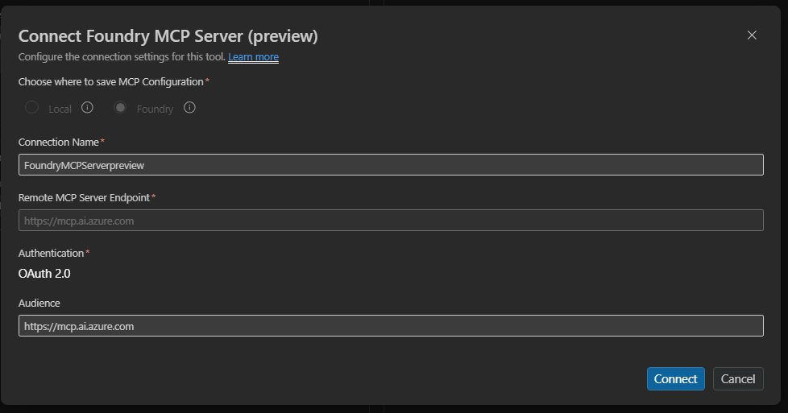
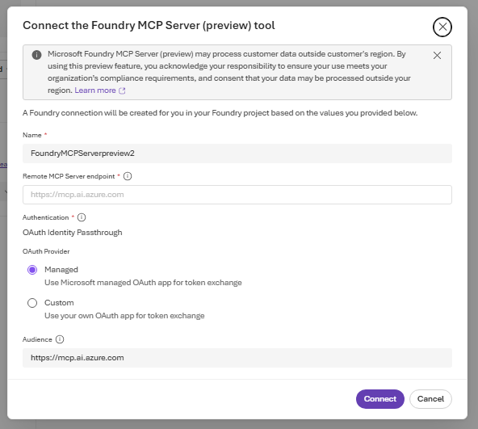

# 9. MCP — User Entra Token (Microsoft first-party on-behalf-of)

Connect to a **Microsoft first-party** MCP server that accepts the **calling user's Entra token**.
Foundry passes the caller's identity through to the downstream server on-behalf-of (OBO) — the tool
acts as the user, not as the agent. Useful for per-user data access (mail, files) where the server
enforces the user's own permissions. This is a **catalog** auth mode: which servers support it is
fixed by the catalog, not something you configure.

**Example server:** the
[Microsoft Foundry MCP server](https://learn.microsoft.com/azure/foundry/mcp/get-started)
(`https://mcp.ai.azure.com`).

> **User Entra Token vs. managed/custom OAuth vs. agent identity?** See
> [MCP authentication modes compared](../../README.md#mcp-authentication) in the toolbox
> guide for how all the auth types differ and when to use each.

---

## Finding the audience

A User Entra Token connection needs an **audience** — the Entra resource the server validates
tokens against. Read it from the server's OAuth metadata:

```bash
curl https://mcp.ai.azure.com/.well-known/oauth-protected-resource
```

Use the `resource` value (e.g. `https://mcp.ai.azure.com`) as the audience. For connector-backed
servers (e.g. Microsoft 365 / Outlook Mail), find the audience in the Foundry Tools Catalog rather
than the `.well-known` endpoint.

---

## VS Code (Foundry Toolkit)

1. In the **Foundry Toolkit** view (signed in), open **Tool Catalog** → **Catalog** tab → **Toolboxes** → **Create Your Toolbox**.

   
2. Enter a toolbox **Name** and description, then in the **Included** panel click **+ Add ▾** →
   **Add tools**, then on the **Catalog** tab select the MCP server (e.g. **Foundry MCP**).

   
   
3. In the connect dialog, set **Authentication** to **User Entra Token** — Foundry forwards the
   calling user's Entra token; no Client ID or secret. Click **Connect**.

   
4. Back on **Build a Custom Toolbox**, click **Publish**. The toolbox appears on the **Toolboxes**
   tab; copy the consumer MCP endpoint from the **Endpoint URL** column into your agent's
   `TOOLBOX_ENDPOINT` — or click **Scaffold code template**.

   

---

## CLI (`azd`)

### 1. Create the connection

```bash
azd ai connection create foundrymcpconn \
  --kind remote-tool \
  --target https://mcp.ai.azure.com \
  --auth-type user-entra-token \
  --audience https://mcp.ai.azure.com \
  --project-endpoint "$FOUNDRY_PROJECT_ENDPOINT"
```

> `--auth-type user-entra-token` forwards the calling user's Entra token — no `--client-id` /
> `--client-secret` / `--scopes`. Swap `--target` and `--audience` for another catalog server (see
> [Finding the audience](#finding-the-audience)).

### 2a. Way A (`toolbox.yaml`)

```yaml
# toolbox.yaml
description: user-entra-token-mcp toolbox
tools:
  - type: mcp
    server_label: foundry-mcp
    project_connection_id: foundrymcpconn
    require_approval: "never"
```

```bash
azd ai toolbox create agent-tools --from-file ./toolbox.yaml --project-endpoint "$FOUNDRY_PROJECT_ENDPOINT"
```

### 2b. Way B (`azure.yaml`)

```yaml
# azure.yaml
name: my-agent-project
services:
  agent-tools:
    host: azure.ai.toolbox
    tools:
      - type: mcp
        server_label: foundry-mcp
        project_connection_id: foundrymcpconn
  my-agent:
    host: azure.ai.agent
    uses:
      - agent-tools
    environmentVariables:
      - name: TOOLBOX_NAME
        value: agent-tools
```

```bash
azd deploy agent-tools
```

---

## Portal (Foundry / Azure)

For a first-party server, add it from the **Catalog** tab — not the **Custom** tab.

1. In the [Foundry portal](https://ai.azure.com/), open **Tools** → **Toolboxes** tab →
   **Create toolbox**. Give it a **Name**.
2. Under **Included**, click **+ Add** → **Add tool** → the **Catalog** tab. Find and select the MCP
   server (e.g. **Foundry MCP**), then **Create**.
3. In the connect dialog, the **Remote MCP Server endpoint** is prefilled. Set **Authentication** to
   **User Entra Token** — Foundry forwards the calling user's Entra token; no Client ID or secret
   required. Click **Connect**.

   
4. The tool appears under **Included**. Click **Publish**, then copy the toolbox **Endpoint** into
   your agent's `TOOLBOX_ENDPOINT`.

   

---

## Notes

- The tool runs as the **calling user** — the downstream server enforces that user's permissions.
- For connector-backed servers (e.g. Microsoft 365 / Outlook Mail), find the audience in the
  Foundry Tools Catalog rather than the `.well-known` endpoint.

## References

- [MCP tool documentation](https://learn.microsoft.com/azure/foundry/agents/how-to/tools/model-context-protocol)
- [Microsoft Foundry MCP server](https://learn.microsoft.com/azure/foundry/mcp/get-started)
