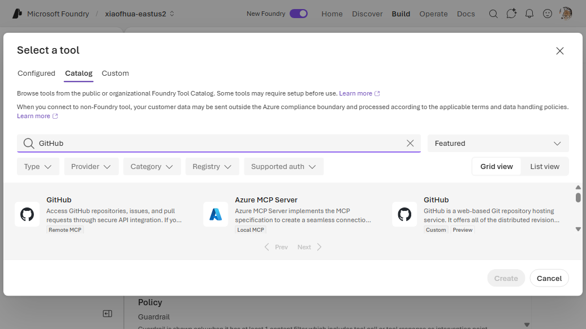
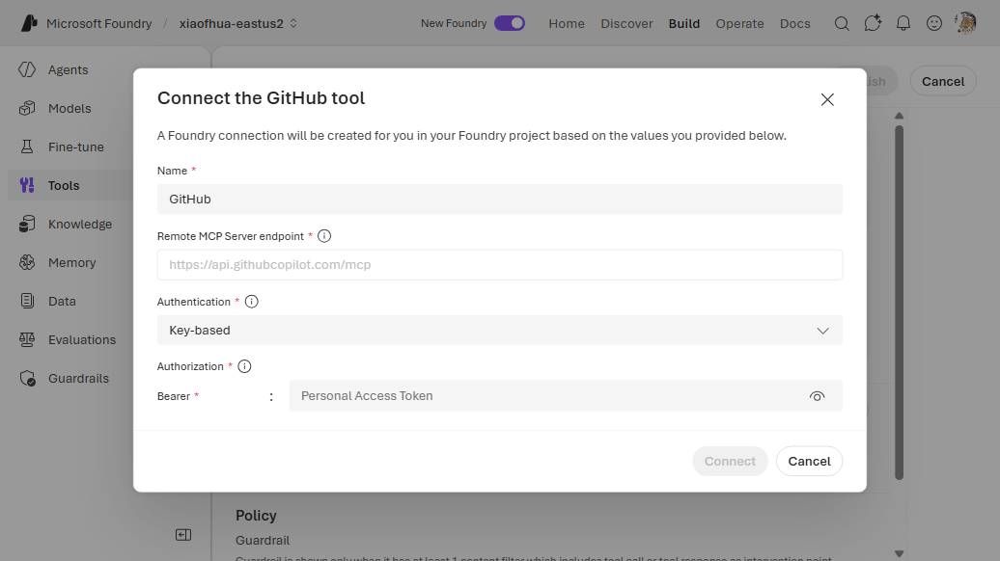
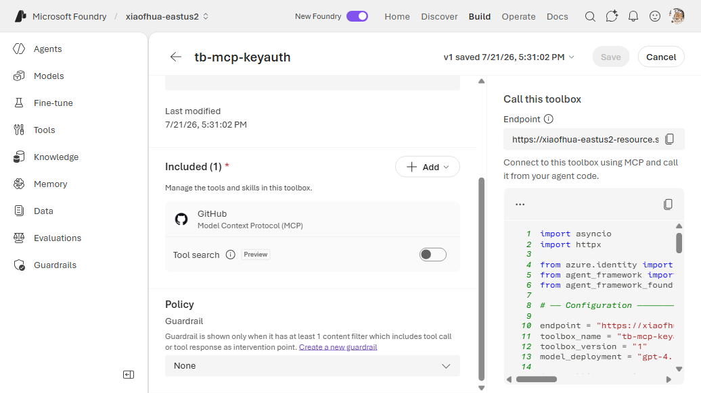

# 5. MCP — Key Auth (GitHub PAT)

Connect to an MCP server that authenticates with a **static key** — for example the GitHub MCP
server with a Personal Access Token injected as a Bearer token. The key is stored in a **connection**
(`CustomKeys`); the toolbox references the connection by name.

**Connection required?** Yes (`CustomKeys`). **Example server:** `https://api.githubcopilot.com/mcp`

---

## 1. Create the connection

```bash
azd ai connection create ghmcppat \
  --kind remote-tool \
  --target https://api.githubcopilot.com/mcp \
  --auth-type custom-keys \
  --custom-key "Authorization=Bearer <github_pat>" \
  --project-endpoint "$FOUNDRY_PROJECT_ENDPOINT"
```

> `<github_pat>` — a classic `ghp_...` or fine-grained `github_pat_...` token.

## 2a. CLI — Way A (`toolbox.yaml`)

```yaml
# toolbox.yaml
description: github-mcp toolbox
tools:
  - type: mcp
    server_label: github
    project_connection_id: ghmcppat
    require_approval: "never"
```

```bash
azd ai toolbox create agent-tools --from-file ./toolbox.yaml --project-endpoint "$FOUNDRY_PROJECT_ENDPOINT"
```

## 2b. CLI — Way B (`azure.yaml`)

```yaml
# azure.yaml
name: my-agent-project
services:
  agent-tools:
    host: azure.ai.toolbox
    tools:
      - type: mcp
        server_label: github
        project_connection_id: ghmcppat
  my-agent:
    host: azure.ai.agent
    uses:
      - agent-tools
    environmentVariables:
      - name: TOOLBOX_NAME
        value: agent-tools
```

```bash
azd deploy agent-tools
```

---

## Portal (Foundry / Azure)

GitHub is a **pre-integrated** MCP server, so add it from the **Catalog** tab rather than
hand-building an MCP connection on the Custom tab — the endpoint and auth structure come pre-set and
you only supply the token.

1. In the [Foundry portal](https://ai.azure.com/), open **Tools** → **Toolboxes** tab →
   **Create toolbox**. Give it a **Name**.
2. Under **Included**, click **+ Add** → **Add tool** → the **Catalog** tab. Search for **GitHub**
   and select the **GitHub** tile (Remote MCP) → **Create**.

   
3. In the **Connect the GitHub tool** dialog, the **Remote MCP Server endpoint**
   (`https://api.githubcopilot.com/mcp`) and **Authentication = Key-based** are pre-filled. Under
   **Authorization → Bearer**, paste your GitHub Personal Access Token. Click **Connect**.

   
4. Click **Publish** and copy the endpoint into `TOOLBOX_ENDPOINT`.

   

> To access **private** repos, install the [Microsoft Foundry Agent Service GitHub
> app](https://github.com/apps/microsoft-foundry-agent-service) on your GitHub account first.
>
> For an MCP server **not** in the Catalog, build it on the **Custom** tab instead: **+ Add** →
> **Add tool** → **Custom** → **Model Context Protocol (MCP)** → set the endpoint, **Authentication
> = Key-based**, and the `Authorization: Bearer <token>` credential.

## VS Code (Foundry Toolkit)

1. Open the **Microsoft Foundry** view and sign in.
2. **Connections** → **Create connection** → **Custom keys**, as above.
3. **Tools** → **Toolboxes** → **Create toolbox** → **Add MCP server** → select the connection.


---

## References

- [MCP tool documentation](https://learn.microsoft.com/azure/foundry/agents/how-to/tools/model-context-protocol)
- [Project connections](https://learn.microsoft.com/azure/ai-foundry/how-to/connections-add)
