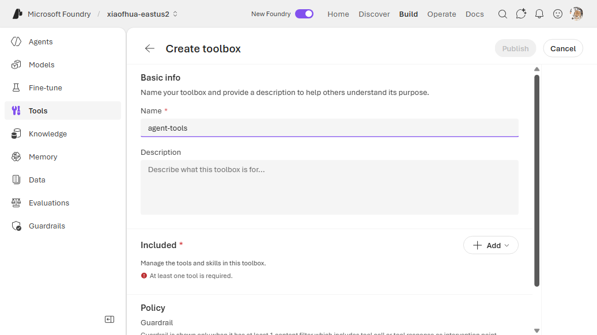
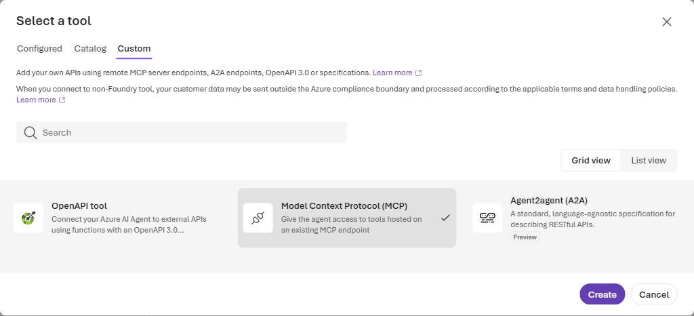
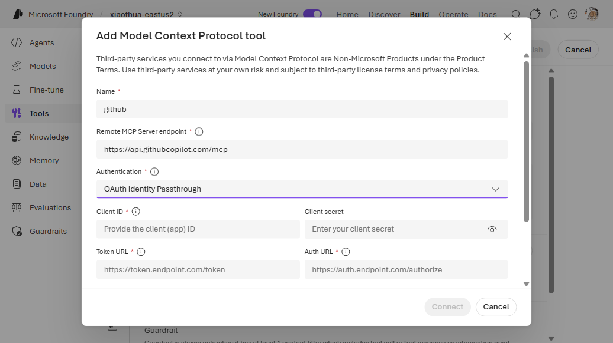
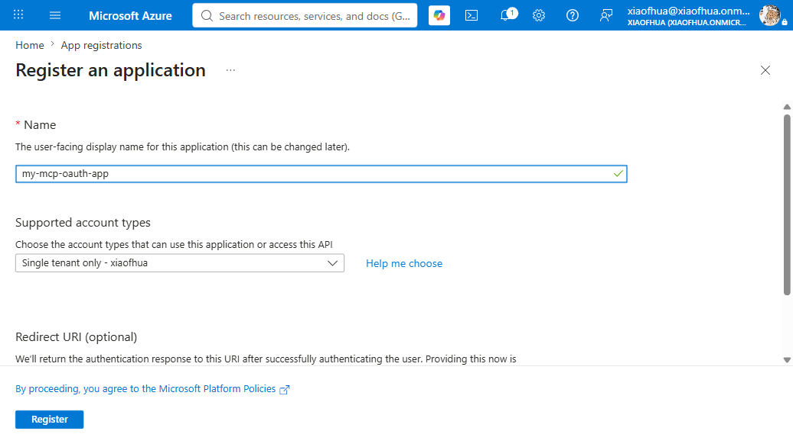
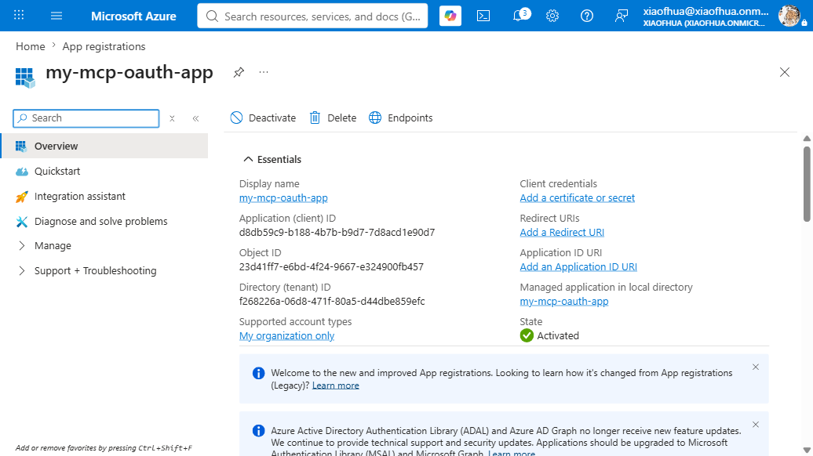
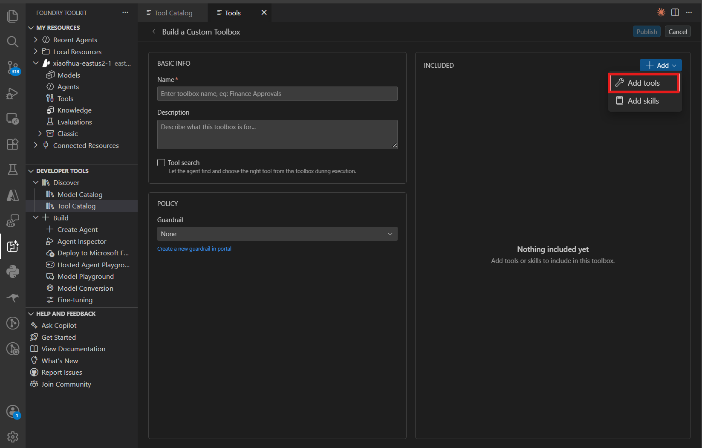
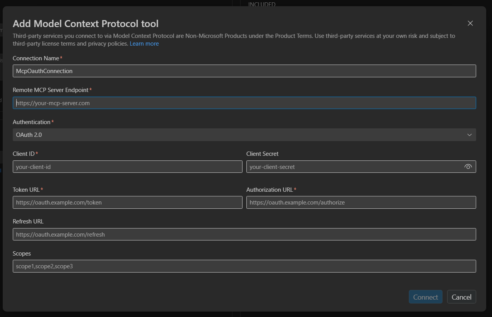
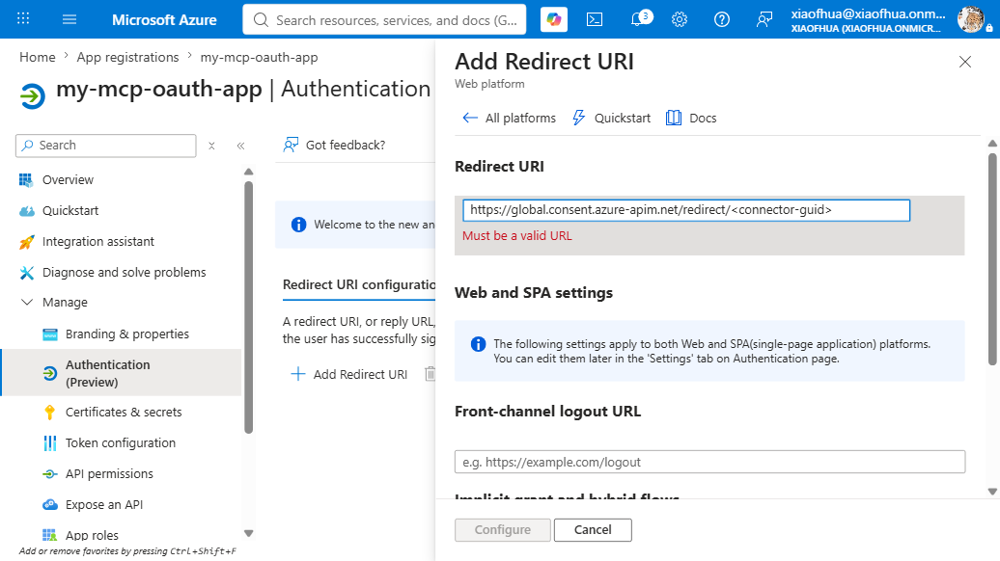

# 7. MCP — OAuth (custom app)

Connect to an MCP server via OAuth2 using **your own app registration** (bring-your-own client ID
and secret). The first invocation triggers a consent flow (MCP code `-32006`).

**Connection required?** Yes (`OAuth2`, custom app). **Example server:**
`https://api.githubcopilot.com/mcp`

---

## 1. Create the connection

```bash
azd ai connection create ghmcpoauthcustom \
  --kind remote-tool \
  --target https://api.githubcopilot.com/mcp \
  --auth-type oauth2 \
  --client-id "<your_client_id>" \
  --client-secret "<your_client_secret>" \
  --authorization-url "https://github.com/login/oauth/authorize" \
  --token-url "https://github.com/login/oauth/access_token" \
  --scopes "repo,read:user" \
  --project-endpoint "$FOUNDRY_PROJECT_ENDPOINT"
```

> Client ID/secret come from **your** OAuth2 app registration. Adjust the authorize/token URLs and
> scopes for your provider.

## 2a. CLI — Way A (`toolbox.yaml`)

```yaml
# toolbox.yaml
description: github-mcp-oauth-custom toolbox
tools:
  - type: mcp
    server_label: github
    project_connection_id: ghmcpoauthcustom
    require_approval: "never"
```

```bash
azd ai toolbox create agent-tools --from-file ./toolbox.yaml --project-endpoint "$FOUNDRY_PROJECT_ENDPOINT"
```

## 2b. CLI — Way B (`azure.yaml`)

```yaml
# azure.yaml
name: my-agent-project
services:
  agent-tools:
    host: azure.ai.toolbox
    tools:
      - type: mcp
        server_label: github
        project_connection_id: ghmcpoauthcustom
  my-agent:
    host: azure.ai.agent
    uses:
      - agent-tools
    environmentVariables:
      - name: TOOLBOX_NAME
        value: agent-tools
```

```bash
azd deploy agent-tools
```

---

## Portal (Foundry / Azure)

1. In the [Foundry portal](https://ai.azure.com/), open **Tools** → **Toolboxes** tab →
   **Create toolbox**. Give it a **Name**.

   
2. Under **Included**, click **+ Add** → **Add tool** → the **Custom** tab → **Model Context
   Protocol (MCP)** → **Create**.

   
3. In the **Add Model Context Protocol tool** dialog: enter a **Name** and the **Remote MCP Server
   endpoint**, set **Authentication** to **OAuth Identity Passthrough**, then fill **Client ID**,
   **Client secret**, **Auth URL**, **Token URL**, and **Scopes** from your Entra app (same values as
   the VS Code table above). Click **Connect**.
4. Add Foundry's generated reply URL to the app's redirect URIs (VS Code Step 3), then **Publish**
   and copy the endpoint into `TOOLBOX_ENDPOINT`.



---

## VS Code (Foundry Toolkit)

Bring your own OAuth app: first register (and configure) an Entra app in the Azure portal, then
fill its values into the MCP tool's **OAuth Identity Passthrough** form in VS Code. The VS Code form
is identical to the portal's **Add Model Context Protocol tool** dialog.

### Step 1 — Register the Entra app (Azure portal)

1. In the [Azure portal](https://portal.azure.com/), open **Microsoft Entra ID** → **App
   registrations** → **New registration**. Give it a name and register. (For a non-Azure provider
   such as GitHub, register the OAuth app with **that** provider instead and skip to Step 2, using
   its authorize/token URLs.)

   
2. On the app's **Overview**, copy the **Application (client) ID** and **Directory (tenant) ID**.

   
3. Under **Certificates & secrets** → **Client secrets** → **New client secret**, create one and
   copy its **Value** immediately.
4. (Azure-hosted MCP) Under **Expose an API**, set the **Application ID URI** (e.g.
   `api://<client-id>`) and add a scope such as `user_impersonation`.
5. Leave **Authentication** → **Redirect URIs** empty for now — you'll add Foundry's generated reply
   URL in Step 3.

### Step 2 — Add the MCP tool in VS Code

1. Open the **Foundry Toolkit** view from the **Activity Bar** and sign in. Under **Developer
   Tools** → **Discover**, open **Tool Catalog**. On the **Catalog** tab, under **Toolboxes**, click
   the **Create Your Toolbox** card to open **Build a Custom Toolbox**.

   
2. Under **Basic info**, enter a **Name** (e.g. `agent-tools`) and an optional description. In the
   **Included** panel, click **+ Add ▾** → **Add tools**.

   

3. In the **Select a tool** dialog, switch to the **Custom** tab, select **Model Context Protocol
   (MCP)**, then **Create**. In the **Add Model Context Protocol tool** dialog, set **Authentication**
   to **OAuth Identity Passthrough** and fill the fields from your Entra app:

   | Field | Value |
   |-------|-------|
   | **Name** | a unique name for the tool |
   | **Remote MCP Server endpoint** | your MCP server URL |
   | **Client ID** | the app's **Application (client) ID** |
   | **Client secret** | the secret **Value** from Step 1.3 |
   | **Auth URL** | `https://login.microsoftonline.com/<tenant-id>/oauth2/v2.0/authorize` |
   | **Token URL** | `https://login.microsoftonline.com/<tenant-id>/oauth2/v2.0/token` |
   | **Refresh URL** | (optional) same as **Token URL** |
   | **Scopes** | space-separated, e.g. `api://<client-id>/user_impersonation offline_access` |

   Click **Connect**.

   

   > For a third-party provider (e.g. GitHub), use that provider's authorize/token URLs
   > (`https://github.com/login/oauth/authorize`, `https://github.com/login/oauth/access_token`) and
   > its scopes instead of the Entra ones.

### Step 3 — Register Foundry's reply URL back on the app

Foundry generates a **per-connection reply URL** when the connection is created. Copy it from the
connection details, then in the Azure portal open the app's **Authentication** → **Add a platform**
→ **Web**, paste the reply URL under **Redirect URIs**, and **Configure**. Without this, consent
fails with an `AADSTS...redirect_uri` mismatch.



### Step 4 — Publish

Back on **Build a Custom Toolbox**, click **Publish**. The toolbox appears on the **Toolboxes** tab.
Copy the consumer MCP endpoint from the **Endpoint URL** column into your agent's `TOOLBOX_ENDPOINT`
— or click **Scaffold code template**. The **first** agent invocation triggers OAuth consent (MCP
code `-32006`).

   

---

## Notes

- Use this when you need control over the OAuth app (scopes, tenant, branding). Otherwise prefer the
  [managed connector](mcp-oauth-managed.md), which requires no client credentials.

## References

- [MCP tool documentation](https://learn.microsoft.com/azure/foundry/agents/how-to/tools/model-context-protocol)
