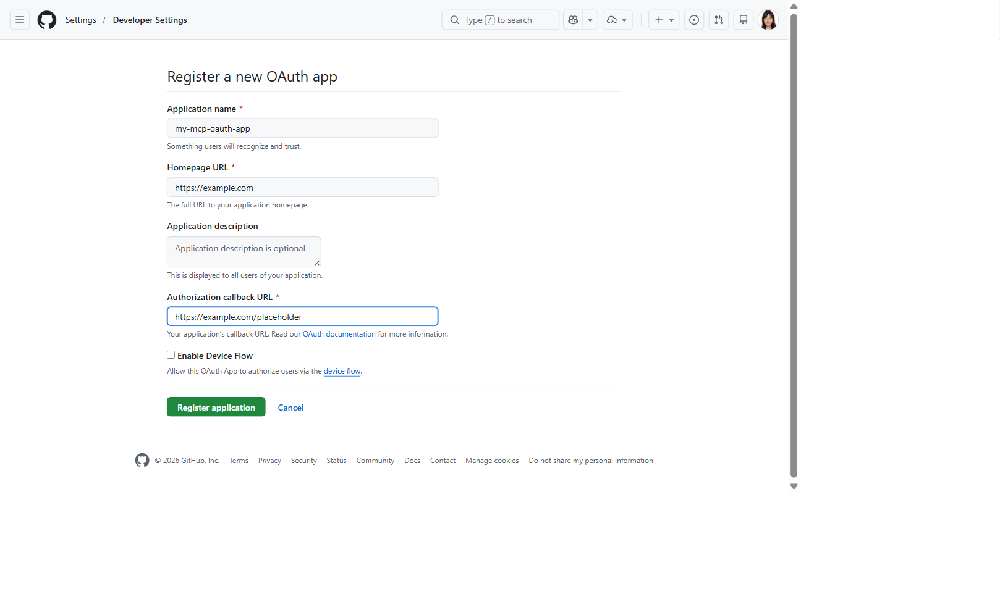
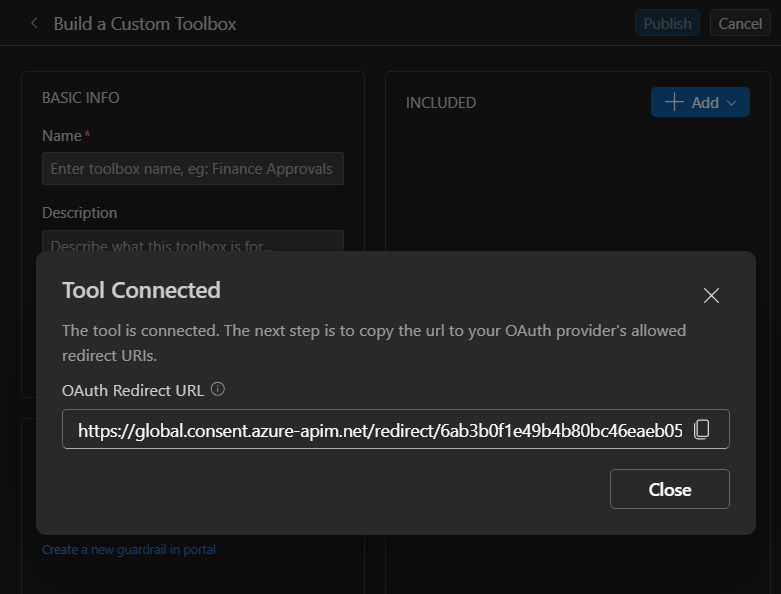

# 7. MCP — OAuth (custom app)

Connect to an MCP server via OAuth2 using **your own app registration** (bring-your-own client ID
and secret). The first invocation triggers a consent flow (MCP code `-32006`).

**Connection required?** Yes (`OAuth2`, custom app). **Example server:**
`https://api.githubcopilot.com/mcp`

---

## Prerequisites — register the OAuth app

Bring your own OAuth app. Where you register it depends on **who owns the MCP server's identity**.
Both paths produce the same five inputs — **Client ID**, **Client secret**, **Auth URL**,
**Token URL**, **Scopes** — which you fill into whichever surface you use below.

| Your MCP is… | Register the OAuth app with… | Follow |
|---|---|---|
| **First-party** — an Azure-hosted MCP you build (e.g. on Azure Functions), or any server behind Microsoft Entra | **Microsoft Entra ID** | [Option A](#option-a--first-party-microsoft-entra-app) |
| **Third-party** — a SaaS / partner / non-Azure MCP (e.g. GitHub) | **that provider's** identity system | [Option B](#option-b--third-party-oauth-app-eg-github) |

### Option A — First-party (Microsoft Entra app)

For OAuth passthrough you need a **client app** that Foundry uses to run the OAuth sign-in — its
**Client ID** and **Client secret** go into the connection. That's the app you register here.

You also need the MCP server's **API scope** (e.g. `api://<api-client-id>/user_impersonation`) for
the **Scopes** field. This scope usually already exists — a published first-party MCP server (such
as a Microsoft-published one) or your own MCP server's registration already exposes it. You just
grant your client app permission to it. Only create an API app yourself if your MCP server has no
registration yet.

1. In the [Azure portal](https://portal.azure.com/), open **Microsoft Entra ID** → **App
   registrations** → **New registration**. Name it (e.g. `my-mcp-client`) and register.

   
2. On the **Overview**, copy the **Application (client) ID** and **Directory (tenant) ID**.

   
3. Under **Certificates & secrets** → **Client secrets** → **New client secret**, create one and
   copy its **Value** immediately.

   
4. Under **API permissions** → **Add a permission**, select the MCP server's API and add its scope
   (e.g. `user_impersonation`). For your own API, it's under **My APIs**; for a published server, use
   the scope from its documentation.
5. Leave **Authentication** → **Redirect URIs** empty for now — you'll add Foundry's generated reply
   URL after the connection exists (see [Register Foundry's reply URL](#register-foundrys-reply-url)).

| Input | Value |
|-------|-------|
| **Client ID** | the client app's **Application (client) ID** |
| **Client secret** | the secret **Value** from step 3 |
| **Auth URL** | `https://login.microsoftonline.com/<tenant-id>/oauth2/v2.0/authorize` |
| **Token URL** | `https://login.microsoftonline.com/<tenant-id>/oauth2/v2.0/token` |
| **Scopes** | space-separated, e.g. `api://<api-client-id>/user_impersonation offline_access` |

> Include `offline_access` so Foundry can auto-refresh the token; without it, users must re-consent
> after the access token expires. Separate multiple scopes with a **single space**.

> **No API app yet?** If your MCP server has no registration, you can reuse the **client app you
> created above** as the API app too — no second registration needed. On that app, go to **Expose an
> API** → set the **Application ID URI** (`api://<client-id>`) and add a `user_impersonation` scope,
> then grant the app permission to its own scope under **API permissions** → **My APIs**. The API and
> client IDs are then the same value, so use `api://<client-id>/user_impersonation offline_access` in
> **Scopes**.

<details>
<summary><b>Or do steps 1–4 with the Azure CLI (<code>az</code>)</b></summary>

Single-app variant — the app is both the OAuth client and its own API. Requires `az login`.

```bash
# 1. Register the app
APP_ID=$(az ad app create --display-name my-mcp-client --query appId -o tsv)
TENANT_ID=$(az account show --query tenantId -o tsv)

# 2. Add a client secret (copy the printed value — it's shown only once)
az ad app credential reset --id "$APP_ID" --display-name toolbox-oauth2 --years 1 --query password -o tsv

# 3. Expose an API: set the Application ID URI + a user_impersonation scope
SCOPE_ID=$(python -c "import uuid; print(uuid.uuid4())")   # any GUID; uuidgen also works
az ad app update --id "$APP_ID" --identifier-uris "api://$APP_ID"
az ad app update --id "$APP_ID" --set api="{\"oauth2PermissionScopes\":[{\"id\":\"$SCOPE_ID\",\"adminConsentDescription\":\"Access API as the signed-in user\",\"adminConsentDisplayName\":\"Access API as user\",\"userConsentDescription\":\"Access API on your behalf\",\"userConsentDisplayName\":\"Access API\",\"value\":\"user_impersonation\",\"type\":\"User\",\"isEnabled\":true}]}"

# 4. Grant the app permission to its own scope
az ad app permission add --id "$APP_ID" --api "$APP_ID" --api-permissions "$SCOPE_ID=Scope"

echo "Client ID : $APP_ID"
echo "Auth URL  : https://login.microsoftonline.com/$TENANT_ID/oauth2/v2.0/authorize"
echo "Token URL : https://login.microsoftonline.com/$TENANT_ID/oauth2/v2.0/token"
echo "Scopes    : api://$APP_ID/user_impersonation offline_access"
```

Leave redirect URIs unset — add Foundry's reply URL later
([Register Foundry's reply URL](#register-foundrys-reply-url)). For the two-app case, register a
separate API app and point `--api` in step 4 at **its** appId.
</details>

### Option B — Third-party OAuth app (e.g. GitHub)

Register the OAuth app with **that provider's** identity system, not Entra. Using a **GitHub OAuth
App** as the example:

1. Create the app at
   [github.com/settings/applications/new](https://github.com/settings/applications/new). Use any
   name/homepage URL; set **Authorization callback URL** to a placeholder — you'll replace it with
   Foundry's reply URL after the connection exists (see
   [Register Foundry's reply URL](#register-foundrys-reply-url)).

   
2. Copy the **Client ID** and **Generate a new client secret**.

| Input | GitHub OAuth App value |
|-------|------------------------|
| **Client ID** | the app's **Client ID** |
| **Client secret** | the generated **client secret** |
| **Auth URL** | `https://github.com/login/oauth/authorize` |
| **Token URL** | `https://github.com/login/oauth/access_token` |
| **Scopes** | space-delimited scope(s) your MCP needs, e.g. `repo read:user` |

Any OAuth2 provider works the same — swap GitHub's endpoint URLs and scopes for yours.

---

## VS Code (Foundry Toolkit)

1. Open the **Foundry Toolkit** view from the **Activity Bar** and sign in. Under **Developer
   Tools** → **Discover**, open **Tool Catalog**. On the **Catalog** tab, under **Toolboxes**, click
   the **Create Your Toolbox** card to open **Build a Custom Toolbox**.

   
2. Under **Basic info**, enter a **Name** (e.g. `agent-tools`) and an optional description. In the
   **Included** panel, click **+ Add ▾** → **Add tools**.

   

3. In the **Select a tool** dialog, switch to the **Custom** tab, select **Model Context Protocol
   (MCP)**, then **Create**. In the **Add Model Context Protocol tool** dialog, enter a **Name** and
   the **Remote MCP Server endpoint**, set **Authentication** to **OAuth Identity Passthrough**, and
   fill **Client ID**, **Client secret**, **Auth URL**, **Token URL**, and **Scopes** from the
   [Prerequisites](#prerequisites--register-the-oauth-app) table (**Refresh URL** is optional — same
   as **Token URL**). Click **Connect**.

   

4. On **Connect**, the **Tool Connected** dialog shows an **OAuth Redirect URL**. Copy it and
   register it on your OAuth app's redirect/callback URIs (Entra: **Authentication** → **Add a
   platform** → **Web**; GitHub: the app's **Authorization callback URL**). Without this, consent
   fails with a `redirect_uri` mismatch. Click **Close**.

   

5. Back on **Build a Custom Toolbox**, click **Publish**. The toolbox appears on the **Toolboxes**
   tab; copy the consumer MCP endpoint from the **Endpoint URL** column into your agent's
   `TOOLBOX_ENDPOINT` — or click **Scaffold code template**. The **first** agent invocation triggers
   OAuth consent (MCP code `-32006`).

   


---

## CLI (`azd`)

### 1. Create the connection

```bash
azd ai connection create ghmcpoauthcustom \
  --kind remote-tool \
  --target https://api.githubcopilot.com/mcp \
  --auth-type oauth2 \
  --client-id "<your_client_id>" \
  --client-secret "<your_client_secret>" \
  --authorization-url "https://github.com/login/oauth/authorize" \
  --token-url "https://github.com/login/oauth/access_token" \
  --scopes "repo,read:user" \
  --project-endpoint "$FOUNDRY_PROJECT_ENDPOINT"
```

> Client ID/secret come from your OAuth app (see
> [Prerequisites](#prerequisites--register-the-oauth-app)). Adjust the authorize/token URLs and
> scopes for your provider — the example above uses GitHub's.

Foundry generates the per-connection **reply URL** as soon as the connection exists. `azd ai
connection show` doesn't surface it — read `properties.redirectUrl` from the ARM record:

```bash
az rest --method get --query "properties.redirectUrl" -o tsv \
  --url "https://management.azure.com/subscriptions/<sub>/resourceGroups/<rg>/providers/Microsoft.CognitiveServices/accounts/<account>/projects/<project>/connections/ghmcpoauthcustom?api-version=2025-06-01"
# => https://global.consent.azure-apim.net/redirect/<connector-guid>
```

Register that URL on your OAuth app now (see
[Register Foundry's reply URL](#register-foundrys-reply-url)) — the `<connector-guid>` is unique per
connection, so read it back rather than guess.

### 2a. Way A (`toolbox.yaml`)

```yaml
# toolbox.yaml
description: github-mcp-oauth-custom toolbox
tools:
  - type: mcp
    server_label: github
    project_connection_id: ghmcpoauthcustom
    require_approval: "never"
```

```bash
azd ai toolbox create agent-tools --from-file ./toolbox.yaml --project-endpoint "$FOUNDRY_PROJECT_ENDPOINT"
```

### 2b. Way B (`azure.yaml`)

```yaml
# azure.yaml
name: my-agent-project
services:
  agent-tools:
    host: azure.ai.toolbox
    tools:
      - type: mcp
        server_label: github
        project_connection_id: ghmcpoauthcustom
  my-agent:
    host: azure.ai.agent
    uses:
      - agent-tools
    environmentVariables:
      - name: TOOLBOX_NAME
        value: agent-tools
```

```bash
azd deploy agent-tools
```

If you didn't already, register the connection's reply URL (read in step 1) on your OAuth app —
see [Register Foundry's reply URL](#register-foundrys-reply-url).

---

## Portal (Foundry / Azure)

1. In the [Foundry portal](https://ai.azure.com/), open **Tools** → **Toolboxes** tab →
   **Create toolbox**. Give it a **Name**.

   
2. Under **Included**, click **+ Add** → **Add tool** → the **Custom** tab → **Model Context
   Protocol (MCP)** → **Create**.

   
3. In the **Add Model Context Protocol tool** dialog: enter a **Name** and the **Remote MCP Server
   endpoint**, set **Authentication** to **OAuth Identity Passthrough**, then fill **Client ID**,
   **Client secret**, **Auth URL**, **Token URL**, and **Scopes** from the
   [Prerequisites](#prerequisites--register-the-oauth-app) table. Click **Connect**.

   
   
4. Register Foundry's reply URL on the app (see [below](#register-foundrys-reply-url)), then
   **Publish** and copy the endpoint into `TOOLBOX_ENDPOINT`.


---

## Register Foundry's reply URL

Foundry generates a **per-connection reply URL** when the connection is created (in VS Code it's
shown in the **Tool Connected** dialog; via CLI/portal, read it from the connection details).
Register that exact URL on the **same OAuth app** you used above, or consent fails with a
`redirect_uri` mismatch.

**First-party (Microsoft Entra app):** in the Azure portal, open the app's **Authentication** →
**Add a platform** → **Web**, paste the reply URL under **Redirect URIs**, and **Configure**.


Or with the Azure CLI:

```bash
az ad app update --id <APP_ID> --web-redirect-uris "<REPLY_URL>"
```

> `--web-redirect-uris` **replaces** the app's full Web redirect-URI list. If the app already has
> other Web redirect URIs to keep, pass them all in the same command (space-separated).

**Third-party (e.g. GitHub):** open the OAuth app's settings and replace the placeholder
**Authorization callback URL** (e.g. `https://example.com/placeholder` from
[Option B](#option-b--third-party-oauth-app-eg-github)) with Foundry's reply URL, then **Update
application**. Any provider works the same — set its allowed redirect/callback URI to Foundry's
reply URL.

---

## Notes

- Use this when you need control over the OAuth app (scopes, tenant, branding). Otherwise prefer the
  [managed connector](mcp-oauth-managed.md), which requires no client credentials.

## References

- [MCP tool documentation](https://learn.microsoft.com/azure/foundry/agents/how-to/tools/model-context-protocol)
